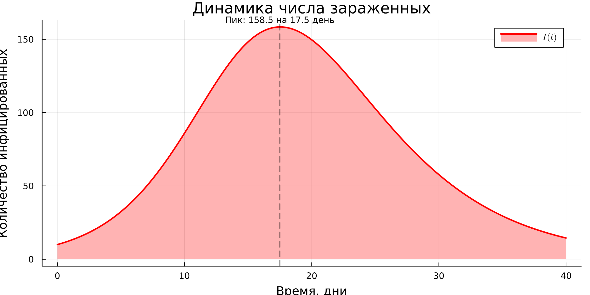
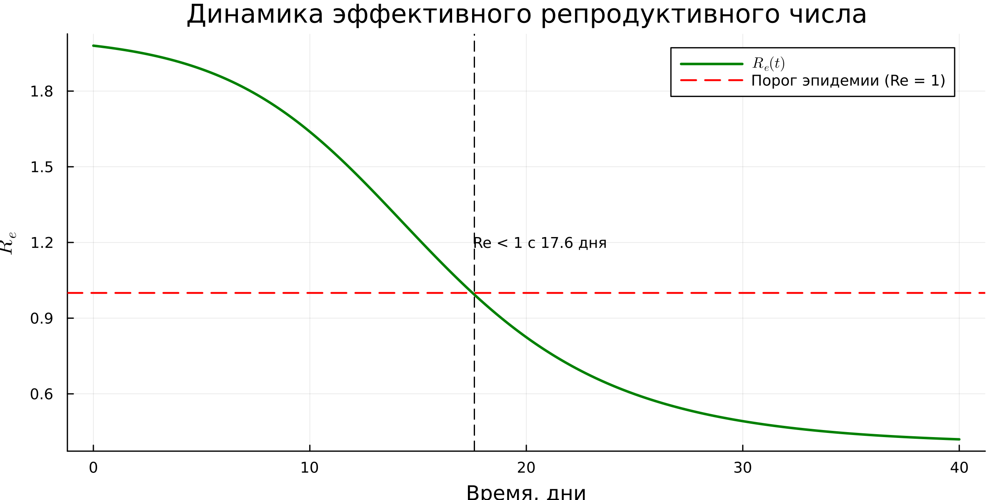
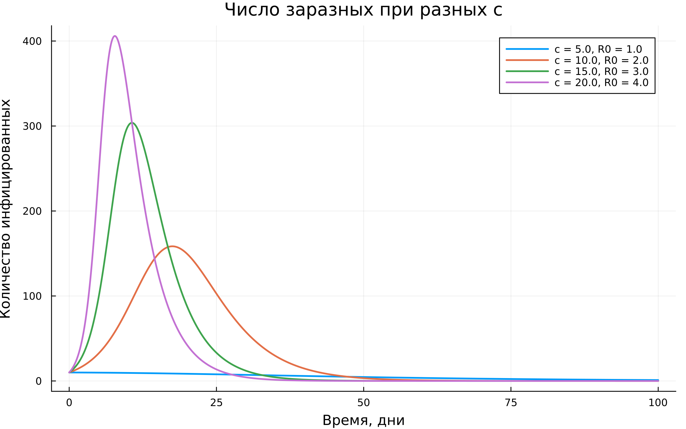
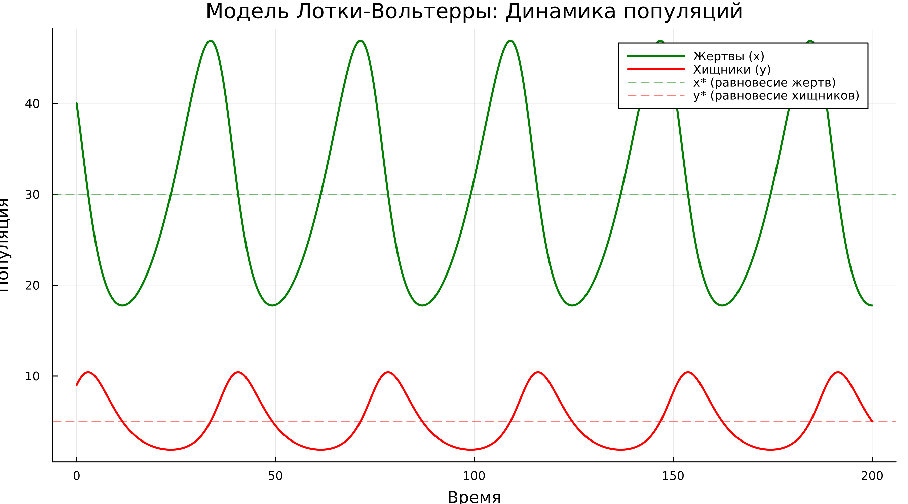
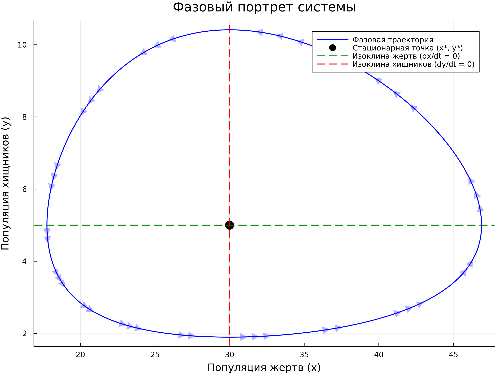
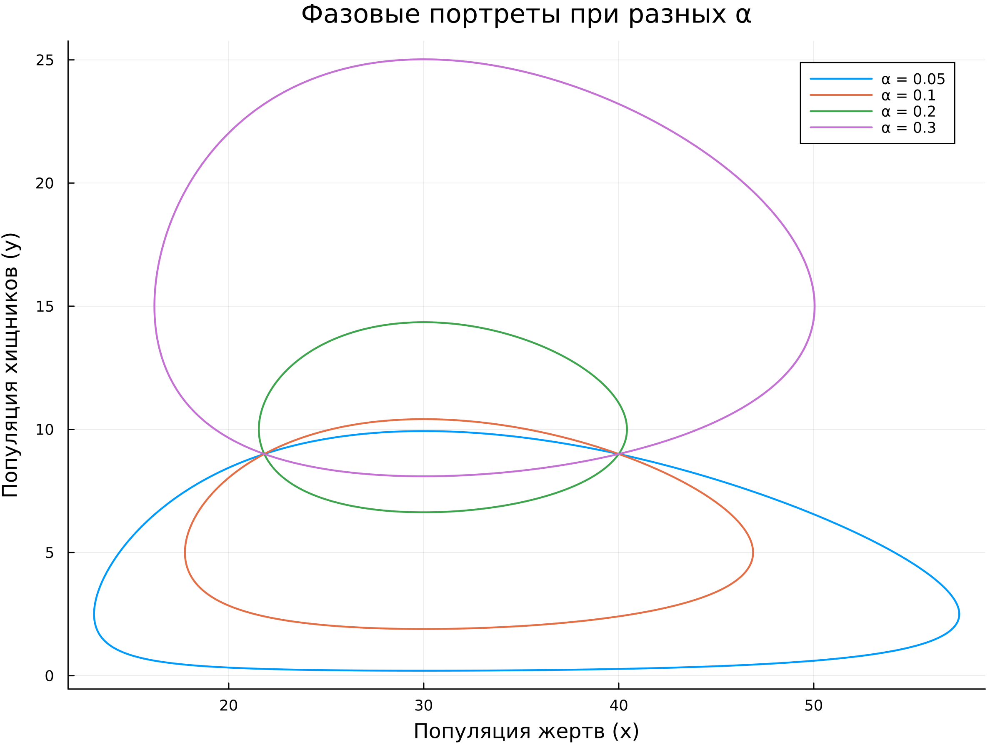

---
## Author
author:
  name: Иван Александрович Бережной
  email: 1132236041@rudn.ru
  affiliation:
    - name: Российский университет дружбы народов
      country: Российская Федерация
      postal-code: 117198
      city: Москва
      address: ул. Миклухо-Маклая, д. 6
## Title
title: "Презентация по лабораторной работе №2"
subtitle: "Имитационное моделирование"
license: CC BY
date: today
date-format: "YYYY-MM-DD" # Example: 2025-09-06
---

# Информация

## Докладчик

  * Иван Александрович Бережной
  * студент
  * Российский университет дружбы народов им. П. Лумумбы
  * 1132236041@rudn.ru

::: notes
- Представиться.
:::

# Вводная часть

## Актуальность

- Модель SIR --- основа для прогноза эпидемий и оценки карантинных мер.
- Модель Лотки-Вольтерры объясняет колебания численности в экосистемах.
- Обе модели простые, но показывают сложное поведение.
- На них отрабатывается исследование модели на наборе параметров.

::: notes
- Обе модели классические, с них начинают изучение своих областей.
:::

## Объект и предмет исследования

- Объект: модель эпидемии SIR и модель «хищник-жертва» Лотки-Вольтерры.
- Предмет: поведение этих моделей при разных значениях параметров.

::: notes
- Интересует не одно решение, а то, как оно меняется вместе с параметрами.
:::

## Цели и задачи

- Цель:
    - Изучить модели SIR и Лотки-Вольтерры и реализовать их на Julia в литературном стиле.
- Задачи:
    - Выполнить код обеих моделей и перевести его в литературный стиль.
    - Получить из него чистый код, ноутбук и документацию.
    - Исследовать каждую модель на наборе параметров.

::: notes
- Задачи обобщены: в методичке их больше, здесь они сгруппированы в три.
:::

## Материалы и методы

Работа выполнялась на виртуальной машине, созданной с помощью VirtualBox на ОС Fedora.

Программное обеспечение:

- Julia с DrWatson, DifferentialEquations, Plots, StatsPlots, FFTW, Literate.
- Quarto, TeX Live.

Методы: численное решение систем ОДУ, параметрическое сканирование, преобразование Фурье.

::: notes
- Для SIR используется решатель по умолчанию, для Лотки-Вольтерры --- Tsit5 с жёсткими допусками.
:::

# Выполнение работы

## Модель SIR

$$
\frac{dS}{dt} = -\beta c \frac{I}{N} S, \quad
\frac{dI}{dt} = \beta c \frac{I}{N} S - \gamma I, \quad
\frac{dR}{dt} = \gamma I
$$

- $S$ --- восприимчивые, $I$ --- заразные, $R$ --- выздоровевшие.
- $\beta$ --- вероятность заражения, $c$ --- число контактов, $\gamma$ --- скорость выздоровления.
- Базовое репродуктивное число: $R_0 = c \beta / \gamma$.

::: notes
- При $R_0 > 1$ эпидемия растёт, при $R_0 < 1$ затухает.
- Порог коллективного иммунитета: $1 - 1/R_0$.
:::

## Модель Лотки-Вольтерры

$$
\frac{dx}{dt} = \alpha x - \beta x y, \quad
\frac{dy}{dt} = \delta x y - \gamma y
$$

- $x$ --- жертвы, $y$ --- хищники.
- Стационарная точка: $x^* = \gamma / \delta$, $y^* = \alpha / \beta$.
- Период малых колебаний: $T \approx 2\pi / \sqrt{\alpha \gamma}$.

::: notes
- Жертвы растут сами и убывают при встречах с хищниками.
- Хищники растут за счёт жертв и убывают от естественной смертности.
:::

## Реализация

- Проект DrWatson, четыре файла в литературном стиле:
    - `sir_ode.jl`, `lv_ode.jl` --- базовый код моделей;
    - `sir_params.jl`, `lv_params.jl` --- расчёт для набора параметров.
- Параметры собраны в `Dict`, `dict_list` строит все комбинации.
- Скрипт `tangle.jl` получает из каждого файла чистый код, ноутбук и документ Quarto.

::: notes
- Имя скрипта задано строкой, чтобы пути работали в ноутбуке и в отчёте.
- В коде методички исправлены шаг в преобразовании Фурье, изоклины и расчёт сдвига фаз.
:::

# Результаты

## SIR: динамика эпидемии

{height=70%}

::: notes
- Параметры: $\beta = 0.05$, $c = 10$, $\gamma = 0.25$, $R_0 = 2$.
- Восприимчивые убывают, выздоровевшие растут, заразные проходят через пик.
:::

## SIR: пик эпидемии

:::::::::::::: {.columns align=center}
::: {.column width="40%"}

- Пик: 158.5 заразных.
- День пика: 17.5.
- Переболело: 77.6%.
- Порог иммунитета: 50%.

:::
::: {.column width="60%"}

:::
::::::::::::::

::: notes
- Пик наступает, когда эффективное репродуктивное число опускается до единицы.
- Переболело больше порога: после его достижения заражения продолжаются, пока есть заразные.
:::

## SIR: эффективное репродуктивное число

{height=65%}

::: notes
- $R_e = R_0 \cdot S / N$ убывает, потому что восприимчивых становится меньше.
- Ниже единицы оно опускается на 17.6 день, это момент пика.
:::

## SIR: набор параметров

|$c$|$R_0$|Пик заразных|День пика|Переболело, %|
|---:|---:|---:|---:|---:|
|5|1.0|10.0|0.0|12.7|
|10|2.0|158.5|17.5|80.0|
|15|3.0|303.8|10.7|94.1|
|20|4.0|405.9|7.8|98.0|

Расчёт на интервале 100 дней.

::: notes
- При $c = 5$ эпидемии нет: число заразных только убывает.
- Чем больше контактов, тем выше и раньше пик.
:::

## SIR: влияние числа контактов

:::::::::::::: {.columns align=center}
::: {.column width="50%"}

:::
::: {.column width="50%"}

:::
::::::::::::::

::: notes
- Слева число заразных при разных $c$, справа итоговая доля переболевших.
- Сокращение контактов снижает и пик, и общее число заболевших.
:::

## Лотка-Вольтерра: динамика популяций

{height=65%}

::: notes
- Параметры: $\alpha = 0.1$, $\beta = 0.02$, $\delta = 0.01$, $\gamma = 0.3$.
- Жертвы колеблются от 17.75 до 46.89, хищники от 1.9 до 10.41.
- Пик хищников отстаёт от пика жертв на 6.9.
:::

## Лотка-Вольтерра: фазовый портрет

:::::::::::::: {.columns align=center}
::: {.column width="40%"}

- Стационарная точка: $x^* = 30$, $y^* = 5$.
- Траектория замкнута.
- Период по пикам: 37.67.
- Период по теории: 36.28.

:::
::: {.column width="60%"}

:::
::::::::::::::

::: notes
- Замкнутая траектория означает незатухающие колебания.
- Пунктиром показаны изоклины: на них одна из популяций не меняется.
:::

## Лотка-Вольтерра: набор параметров

|$\alpha$|$y^*$|Период (расчёт)|Период (теория)|
|---:|---:|---:|---:|
|0.05|2.5|59.5|51.3|
|0.1|5.0|37.67|36.28|
|0.2|10.0|25.91|25.65|
|0.3|15.0|21.5|20.94|

::: notes
- С ростом $\alpha$ период уменьшается, равновесное число хищников растёт.
- Равновесное число жертв от $\alpha$ не зависит.
:::

## Лотка-Вольтерра: влияние $\alpha$

:::::::::::::: {.columns align=center}
::: {.column width="50%"}

:::
::: {.column width="50%"}

:::
::::::::::::::

::: notes
- Слева фазовые портреты, справа зависимость периода от $\alpha$.
- Расчётный период больше теоретического: формула верна только для малых колебаний.
:::

# Заключение

## Главный вывод

Модели SIR и Лотки-Вольтерры реализованы на Julia в литературном стиле. В модели SIR ход эпидемии определяется числом $R_0$: сокращение контактов снижает пик и долю переболевших. В модели Лотки-Вольтерры популяции колеблются вокруг стационарной точки, а период уменьшается с ростом $\alpha$.

::: notes
- Поблагодарить устно и перейти к вопросам.
:::
