---
## Author
author:
  name: Иван Александрович Бережной
  email: 1132236041@rudn.ru
  affiliation:
    - name: Российский университет дружбы народов
      country: Российская Федерация
      postal-code: 117198
      city: Москва
      address: ул. Миклухо-Маклая, д. 6
## Title
title: "Отчёт по лабораторной работе №2"
subtitle: "Имитационное моделирование"
license: "CC BY"
abstract: |
  В отчёте представлены результаты моделирования эпидемии по модели SIR и системы «хищник-жертва» по модели Лотки-Вольтерры на языке Julia.

keywords: [лабораторная работа, Julia, SIR, модель Лотки-Вольтерры]
---

# Введение

## Цель работы

Изучить модели SIR и Лотки-Вольтерры и реализовать их на языке Julia в литературном стиле.

## Задачи

- Создать рабочий каталог для кода.
- Установить необходимые пакеты.
- Выполнить предложенный код.
- Преобразовать код в литературный стиль.
- Сгенерировать из литературного кода:
    - чистый код;
    - jupyter notebook;
    - документацию в формате Quarto.
- Выполнить код из jupyter notebook.
- Интегрировать документацию в формате Quarto в отчёт.
- Добавить в код в литературном стиле вычисление для набора параметров.
- Сгенерировать из литературного кода с параметрами:
    - чистый код;
    - jupyter notebook;
    - документацию в формате Quarto.
- Выполнить код из jupyter notebook с параметрами.
- Интегрировать документацию с параметрами в формате Quarto в отчёт.

## Объект и предмет исследования

Объект исследования --- модель эпидемии SIR и модель хищник-жертва Лотки-Вольтерры.

Предмет исследования --- поведение этих моделей при разных значениях параметров.

## Методы исследования

- Численное решение систем обыкновенных дифференциальных уравнений.
- Параметрическое сканирование.
- Спектральный анализ (преобразование Фурье).
- Литературное программирование.

## Схема выполнения работы

На рис. -@fig-flowchart представлена общая последовательность действий при выполнении работы.

::: {#fig-flowchart}

```{mermaid}
%%| fig-width: 100%
graph TD
    A@{ shape: circle, label: "Начало" } --> B[Создать проект и установить пакеты]
    B --> C[Выполнить код модели SIR]
    C --> D[Добавить набор параметров для SIR]
    D --> E[Выполнить код модели Лотки-Вольтерры]
    E --> F[Добавить набор параметров для Лотки-Вольтерры]
    F --> G[Сгенерировать чистый код, ноутбуки и Quarto]
    G --> J@{ shape: dbl-circ, label: "Конец" }
```

Блок-схема выполнения лабораторной работы

:::

# Теоретическая часть

## Модель SIR

Модель SIR описывает распространение болезни в закрытой популяции. Население делится на три группы: $S$ --- восприимчивые, $I$ --- заразные, $R$ --- выздоровевшие. Общая численность $N = S + I + R$ постоянна.

$$
\frac{dS}{dt} = -\beta c \frac{I}{N} S, \quad
\frac{dI}{dt} = \beta c \frac{I}{N} S - \gamma I, \quad
\frac{dR}{dt} = \gamma I
$$ {#eq-sir}

Здесь $\beta$ --- вероятность заражения при контакте, $c$ --- число контактов в единицу времени, $\gamma$ --- скорость выздоровления.

Базовое репродуктивное число $R_0 = c \beta / \gamma$ показывает, скольких человек заражает один больной. При $R_0 > 1$ эпидемия растёт, при $R_0 < 1$ затухает. Порог коллективного иммунитета равен $1 - 1/R_0$.

## Модель Лотки-Вольтерры

Модель описывает взаимодействие жертв $x$ и хищников $y$.

$$
\frac{dx}{dt} = \alpha x - \beta x y, \quad
\frac{dy}{dt} = \delta x y - \gamma y
$$ {#eq-lv}

Здесь $\alpha$ --- прирост жертв, $\beta$ --- коэффициент поедания жертв, $\delta$ --- прирост хищников за счёт жертв, $\gamma$ --- смертность хищников.

Стационарная точка: $x^* = \gamma / \delta$, $y^* = \alpha / \beta$. Вокруг неё популяции совершают колебания. Период малых колебаний $T \approx 2\pi / \sqrt{\alpha \gamma}$.

# Материалы и методы

Работа выполнялась на виртуальной машине, созданной с помощью VirtualBox на ОС Fedora.

Программное обеспечение:

- git, git-flow.
- Julia с DrWatson, DifferentialEquations, Plots, StatsPlots, FFTW, Literate.
- Quarto, TeX.

# Выполнение лабораторной работы

Работа выполнялась по методическим указаниям [@simmod_lab02].

## Создание проекта

В каталоге лабораторной работы создадим проект DrWatson (рис. -@fig-001).

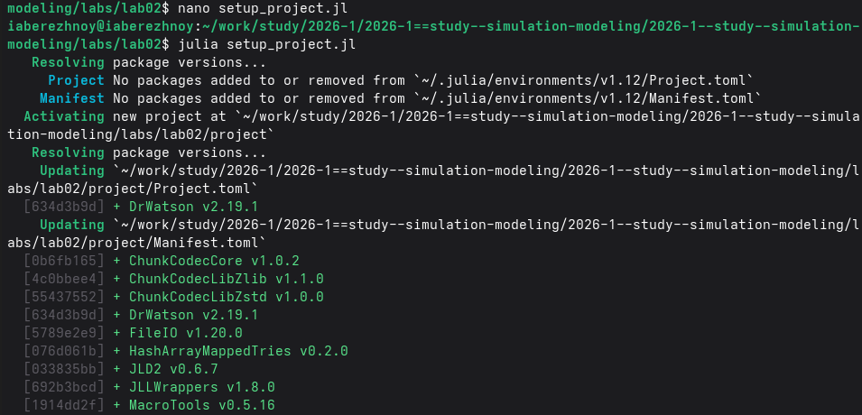{#fig-001 width=100%}

Скриптом `add_packages.jl` добавим базовые пакеты (рис. -@fig-002). Дополнительно добавим пакеты, необходимые для выполнения кода, такие как `Tables`, `StatsPlots` и другие.

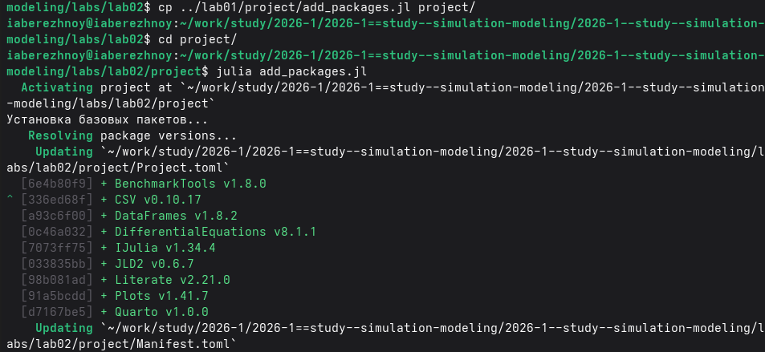{#fig-002 width=100%}

## Модель SIR

Запишем код модели в файл `scripts/sir_ode.jl` в литературном стиле и выполним его (рис. -@fig-003).

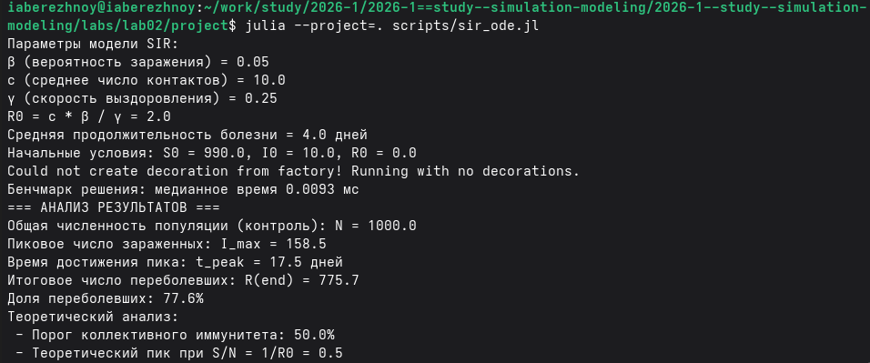{#fig-003 width=100%}

В файле `scripts/sir_params.jl` добавим вычисление для набора параметров: число контактов $c$ принимает значения 5, 10, 15 и 20. Выполним скрипт (рис. -@fig-004).

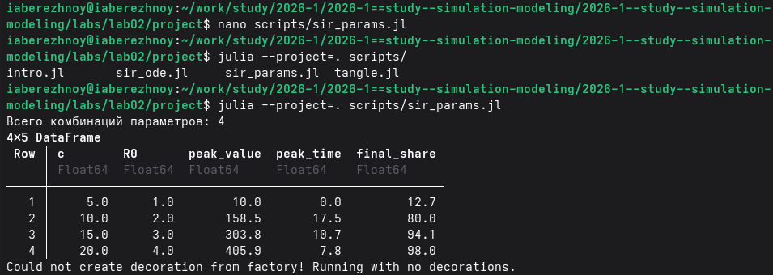{#fig-004 width=100%}

## Модель Лотки-Вольтерры

Запишем код модели в файл `scripts/lv_ode.jl` в литературном стиле и выполним его (рис. -@fig-005).

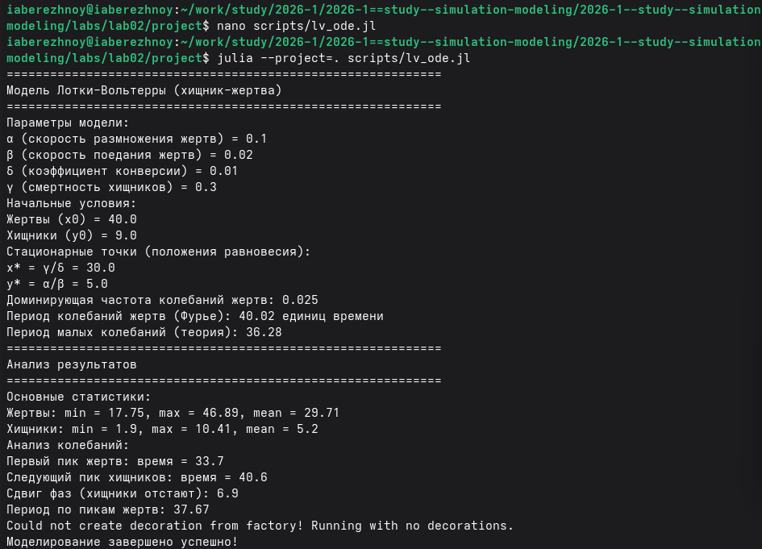{#fig-005 width=100%}

В файле `scripts/lv_params.jl` добавим вычисление для набора параметров: скорость размножения жертв $\alpha$ принимает значения 0.05, 0.1, 0.2 и 0.3. Выполним скрипт (рис. -@fig-006).

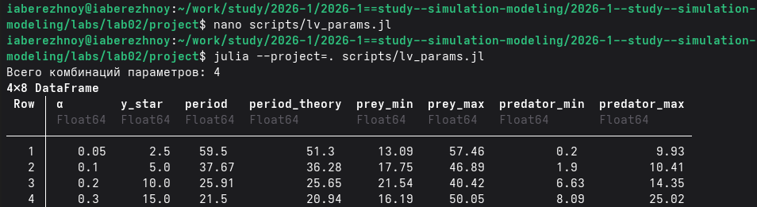{#fig-006 width=100%}

## Производные форматы

С помощью скрипта `scripts/tangle.jl` сгенерируем из каждого файла чистый код, ноутбук и Quarto (рис. -@fig-007).

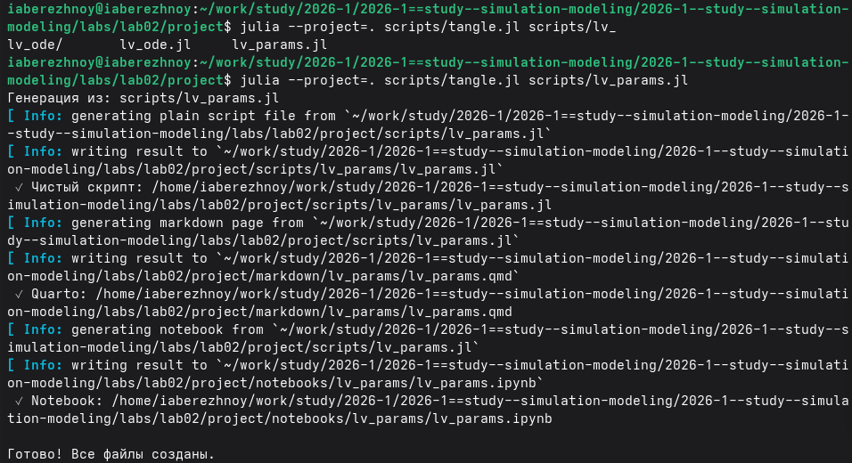{#fig-007 width=100%}

Выполним все ноутбуки в Jupyter (рис. -@fig-008).

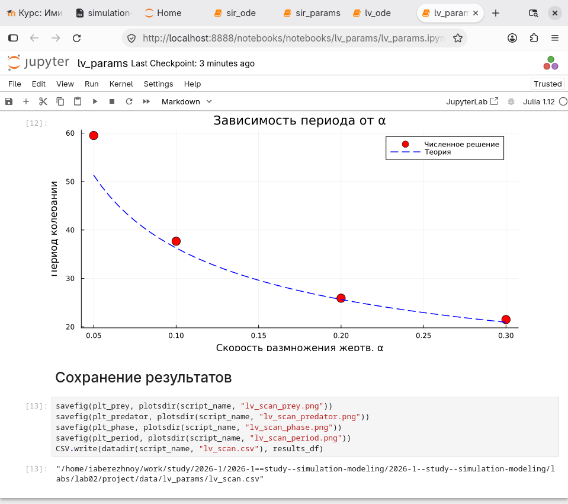{#fig-008 width=100%}

В файле `_quarto.yml` включим поддержку Julia, в преамбуле `preamble.tex` подключим нужный шрифт.

# Результаты

## Модель SIR

При $\beta = 0.05$, $c = 10$, $\gamma = 0.25$ получаем $R_0 = 2$. Динамика трёх групп показана на рис. -@fig-009.

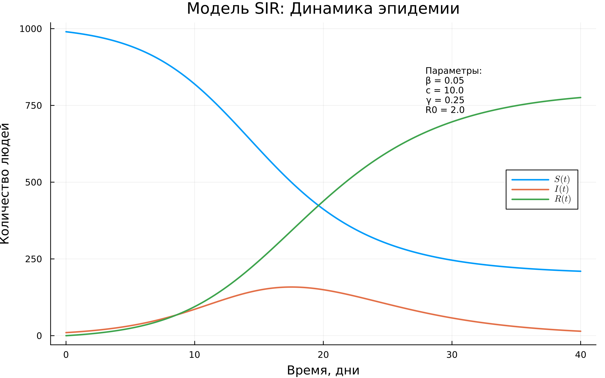{#fig-009 width=100%}

Пик эпидемии --- 158.5 заразных на 17.5 день (рис. -@fig-010). Всего переболело 775.7 человек, это 77.6% населения.

{#fig-010 width=100%}

Эффективное репродуктивное число опускается ниже единицы в момент пика (рис. -@fig-011).

{#fig-011 width=100%}

Результаты для набора параметров приведены в табл. -@tbl-sir.

|$c$|$R_0$|Пик заразных|День пика|Переболело, %|
|---:|---:|---:|---:|---:|
|5|1.0|10.0|0.0|12.7|
|10|2.0|158.5|17.5|80.0|
|15|3.0|303.8|10.7|94.1|
|20|4.0|405.9|7.8|98.0|

: Модель SIR при разном числе контактов {#tbl-sir}

Число заразных при разных $c$ показано на рис. -@fig-012, итоговая доля переболевших --- на рис. -@fig-013.

{#fig-012 width=100%}

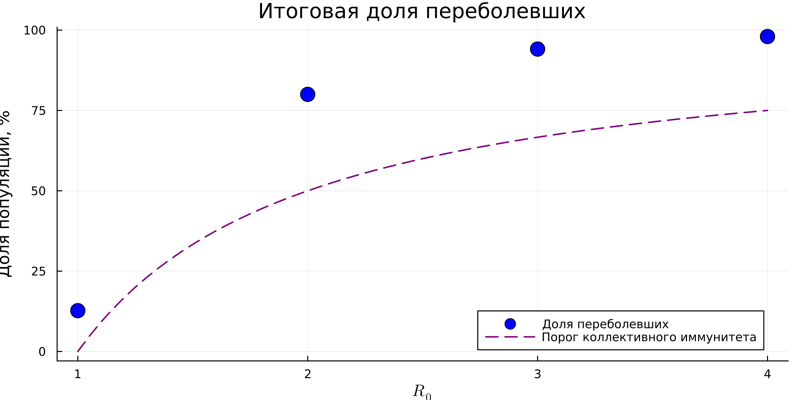{#fig-013 width=100%}

## Модель Лотки-Вольтерры

При $\alpha = 0.1$, $\beta = 0.02$, $\delta = 0.01$, $\gamma = 0.3$ стационарная точка: $x^* = 30$, $y^* = 5$. Динамика популяций показана на рис. -@fig-014.

{#fig-014 width=100%}

Жертвы колеблются от 17.75 до 46.89, хищники --- от 1.9 до 10.41. Период по пикам равен 37.67. Пик хищников отстаёт от пика жертв на 6.9. Фазовая траектория замкнута вокруг стационарной точки (рис. -@fig-015).

{#fig-015 width=90%}

Результаты для набора параметров приведены в табл. -@tbl-lv.

|$\alpha$|$y^*$|Период (расчёт)|Период (теория)|
|---:|---:|---:|---:|
|0.05|2.5|59.5|51.3|
|0.1|5.0|37.67|36.28|
|0.2|10.0|25.91|25.65|
|0.3|15.0|21.5|20.94|

: Модель Лотки-Вольтерры при разных $\alpha$ {#tbl-lv}

Фазовые портреты при разных $\alpha$ показаны на рис. -@fig-016, зависимость периода от $\alpha$ --- на рис. -@fig-017.

{#fig-016 width=90%}

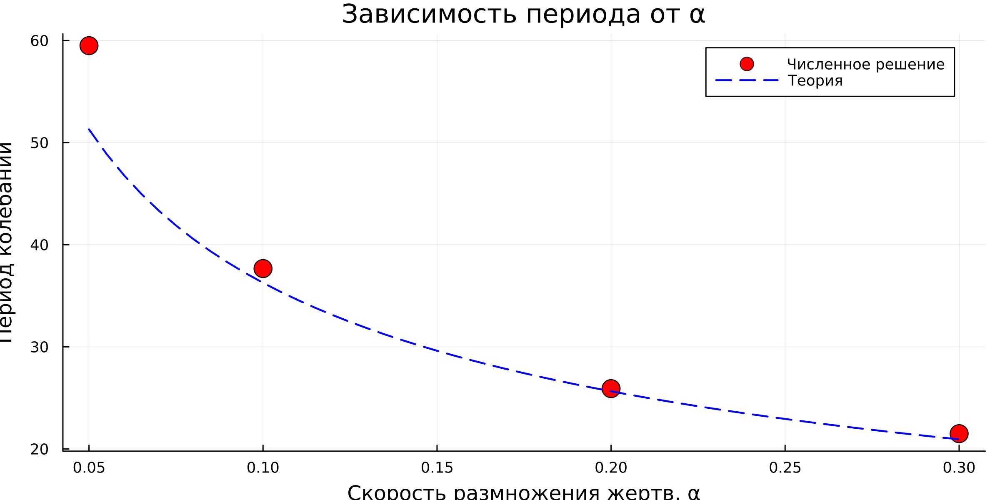{#fig-017 width=100%}

# Обсуждение результатов

В модели SIR ход эпидемии определяется числом $R_0$. При $c = 5$ получаем $R_0 = 1$, и эпидемия не развивается: число заразных только убывает. С ростом числа контактов пик становится выше и наступает раньше, а доля переболевших растёт до 98%. Значит, сокращение контактов снижает и пик, и общее число заболевших.

Итоговая доля переболевших при $R_0 = 2$ составляет 80%, что больше порога коллективного иммунитета 50%. После достижения порога заражения продолжаются, пока есть заразные.

В модели Лотки-Вольтерры популяции совершают незатухающие колебания вокруг стационарной точки. С ростом $\alpha$ период уменьшается, а равновесное число хищников растёт. Равновесное число жертв от $\alpha$ не зависит.

Расчётный период больше теоретического, потому что формула верна только для малых колебаний. Чем дальше начальная точка от равновесия, тем больше расхождение: при $\alpha = 0.05$ оно наибольшее.

Период по Фурье (40.02) отличается от периода по пикам (37.67) из-за грубого шага по частоте: на интервале длиной 200 помещается всего около пяти периодов.

# Заключение

Модели SIR и Лотки-Вольтерры реализованы на Julia в литературном стиле. Для каждой получены чистый код, ноутбук и документация Quarto. Выполнено исследование на наборе параметров.

# Список литературы {.unnumbered}

::: {#refs}
:::

\appendix








