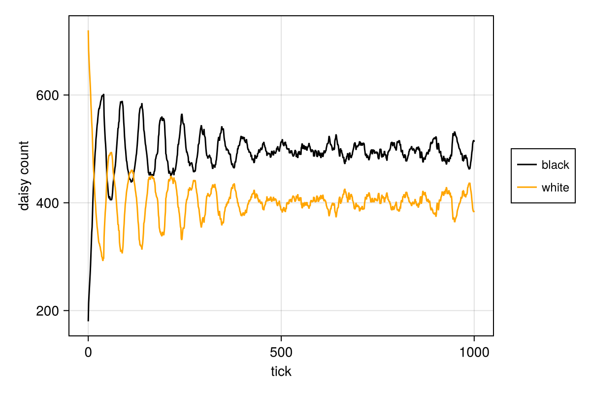
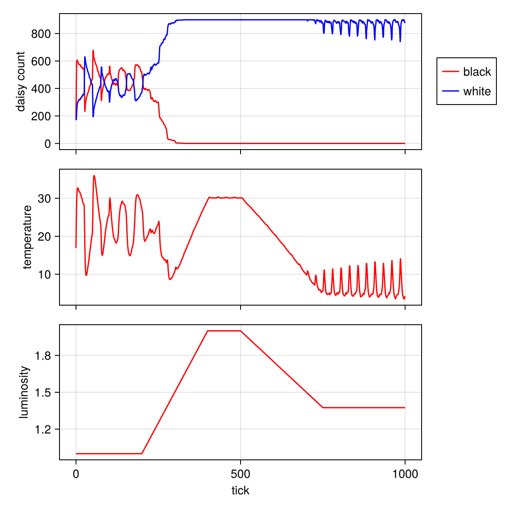

---
## Author
author:
  name: Иван Александрович Бережной
  email: 1132236041@rudn.ru
  affiliation:
    - name: Российский университет дружбы народов
      country: Российская Федерация
      postal-code: 117198
      city: Москва
      address: ул. Миклухо-Маклая, д. 6
## Title
title: "Презентация по лабораторной работе №3"
subtitle: "Имитационное моделирование"
license: CC BY
date: today
date-format: "YYYY-MM-DD" # Example: 2025-09-06
---

# Информация

## Докладчик

  * Иван Александрович Бережной
  * студент
  * Российский университет дружбы народов им. П. Лумумбы
  * 1132236041@rudn.ru

::: notes
- Представиться.
:::

# Вводная часть

## Актуальность

- Многие системы трудно описать общими уравнениями.
- Агентный подход описывает отдельных участников и их правила.
- Общая картина возникает из их взаимодействия.
- Daisyworld показывает, как живые организмы могут регулировать климат планеты.

## Объект и предмет исследования

- Объект: агентная модель Daisyworld.
- Предмет: динамика числа маргариток и температуры поверхности при разных параметрах модели.

## Цели и задачи

- Цель:
    - Изучить агентный подход к моделированию и реализовать модель Daisyworld на языке Julia в литературном стиле.
- Задачи:
    - Выполнить код модели, получить карты, анимацию и графики динамики.
    - Перевести код в литературный стиль и получить чистый код, ноутбуки и документацию Quarto.
    - Исследовать модель на наборе параметров.

## Материалы и методы

Работа выполнялась на виртуальной машине, созданной с помощью VirtualBox на ОС Fedora.

Программное обеспечение:

- Julia с DrWatson, Agents, StatsBase, CairoMakie.
- Quarto, TeX Live.

Методы: агентное моделирование на клеточной сетке, визуализация, параметрическое сканирование.

# Выполнение работы

## Модель Daisyworld

- Сетка 30 на 30 клеток, агенты --- чёрные и белые маргаритки.
- Чёрные (альбедо 0.25) поглощают свет и нагревают клетку.
- Белые (альбедо 0.75) отражают свет и охлаждают клетку.
- Тепло распространяется между соседними клетками.
- Маргаритка умирает при достижении максимального возраста.

::: notes
- Альбедо --- доля отражённого света.
- У агента три свойства: вид, возраст и альбедо.
:::

## Размножение маргариток

Вероятность дать потомка в соседней пустой клетке:

$$
p = 0.1457 \, T - 0.0032 \, T^2 - 0.6443
$$

- Положительна примерно от 5 до 40 градусов.
- Наибольшая около 22.5 градуса.
- Потомок того же вида, что и родитель.

::: notes
- Отсюда саморегуляция: при холоде выгоднее чёрным, при жаре белым.
:::

## Реализация

- Код модели в `src/daisyworld.jl`.
- Семь скриптов: карты, анимация, число маргариток, динамика модели и три варианта с параметрами.
- Шесть скриптов оформлены в литературном стиле.
- Набор параметров: максимальный возраст 25 и 40, начальная доля белых 0.2 и 0.8.

::: notes
- `dict_list` строит четыре комбинации, `savename` формирует имена файлов.
- Видео размещено на Rutube и VK Видео.
:::

# Результаты

## Начальное состояние и 5 шагов

:::::::::::::: {.columns align=center}
::: {.column width="50%"}

:::
::: {.column width="50%"}

:::
::::::::::::::

::: notes
- Слева начало: маргаритки занимают 40% клеток и расставлены случайно.
- Справа через 5 шагов: сетка почти заполнена.
- Фон --- температура: вокруг чёрных теплее, вокруг белых холоднее.
:::

## Состояние через 45 шагов

{height=75%}

::: notes
- Маргаритки одного вида собираются в группы.
- Температура в группах чёрных выше, в группах белых ниже.
:::

## Число маргариток

{height=70%}

::: notes
- Светимость постоянна и равна 1.0, выполнено 1000 шагов.
- Чёрных от 370 до 600, белых от 300 до 550.
- Колебания в противофазе: когда чёрных больше, белых меньше.
:::

## Динамика модели: сценарий ramp

:::::::::::::: {.columns align=center}
::: {.column width="45%"}

- Светимость: от 1.0 до 2.0, затем до 1.375.
- Чёрные вымирают к 330 шагу.
- Белые занимают всю сетку.
- Дальше температура повторяет светимость.

:::
::: {.column width="55%"}

:::
::::::::::::::

::: notes
- Пока идёт вытеснение чёрных, температура падает с 20 до 8 градусов, хотя светимость растёт.
- Чёрные обратно не появляются: потомок бывает только от соседа своего вида.
:::

## Набор параметров: число маргариток

|Возраст|Доля белых|Чёрные|Белые|
|---:|---:|---:|---:|
|25|0.2|446|444|
|25|0.8|490|406|
|40|0.2|431|464|
|40|0.8|506|392|

Число маргариток на 1000 шаге.

::: notes
- Начальная доля белых влияет только на начало расчёта.
- Во всех случаях система приходит к близкому соотношению.
:::

## Влияние параметров на колебания

:::::::::::::: {.columns align=center}
::: {.column width="50%"}

:::
::: {.column width="50%"}

:::
::::::::::::::

::: notes
- Слева возраст 25 и доля белых 0.2, справа возраст 40 и доля белых 0.8.
- При большем возрасте колебания реже и слабее, при большой начальной доле белых они быстро затухают.
:::

## Набор параметров: сценарий ramp

:::::::::::::: {.columns align=center}
::: {.column width="50%"}

:::
::: {.column width="50%"}

:::
::::::::::::::

::: notes
- Слева доля белых 0.2, справа 0.8, возраст 25.
- Во всех четырёх наборах чёрные вымирают, остаётся от 865 до 892 белых.
- Итоговая температура от 4.0 до 6.3 градуса.
:::

# Заключение

## Главный вывод

Модель Daisyworld реализована на Julia с помощью Agents.jl. При постоянной светимости оба вида сосуществуют и удерживают температуру. При сильном росте светимости чёрные маргаритки вымирают, и саморегуляция пропадает. Этот результат не зависит от начальной доли белых и максимального возраста.

::: notes
- Поблагодарить устно и перейти к вопросам.
:::
