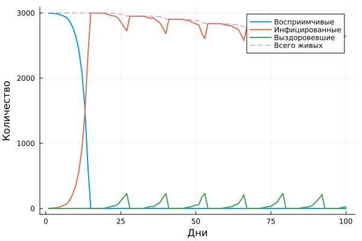
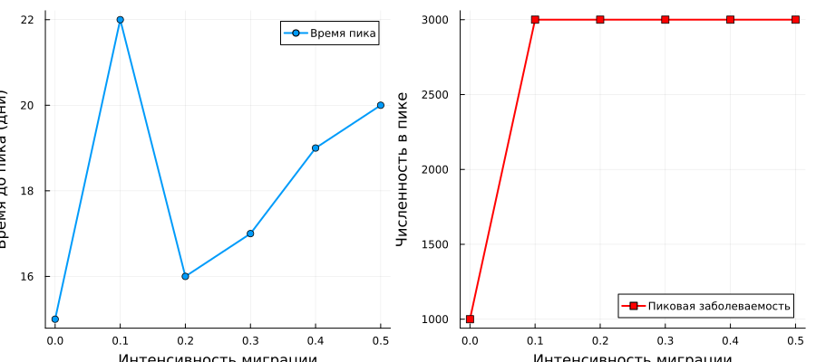

---
## Author
author:
  name: Иван Александрович Бережной
  email: 1132236041@rudn.ru
  affiliation:
    - name: Российский университет дружбы народов
      country: Российская Федерация
      postal-code: 117198
      city: Москва
      address: ул. Миклухо-Маклая, д. 6
## Title
title: "Презентация по лабораторной работе №4"
subtitle: "Имитационное моделирование"
license: CC BY
date: today
date-format: "YYYY-MM-DD" # Example: 2025-09-06
---

# Информация

## Докладчик

  * Иван Александрович Бережной
  * студент
  * Российский университет дружбы народов им. П. Лумумбы
  * 1132236041@rudn.ru

::: notes
- Представиться.
:::

# Вводная часть

## Актуальность

- Модель SIR на уравнениях считает всех людей одинаковыми.
- Она не учитывает города, переезды и случайность.
- Агентный подход моделирует каждого человека отдельно.
- Это позволяет изучать миграцию и меры контроля.

::: notes
- Та же эпидемия, что во второй работе, но другим методом.
:::

## Объект и предмет исследования

- Объект: агентная модель эпидемии SIR на графе городов.
- Предмет: влияние заразности и миграции на ход эпидемии.

::: notes
- Граф состоит из трёх городов, все связаны между собой.
:::

## Цели и задачи

- Цель:
    - Реализовать модель SIR в агентном подходе на Julia в литературном стиле и исследовать её на наборе параметров.
- Задачи:
    - Выполнить базовый эксперимент.
    - Исследовать влияние заразности и миграции, выполнить оптимизацию.
    - Перевести код в литературный стиль и получить чистый код, ноутбуки и документацию.

::: notes
- Задачи обобщены: в методичке их больше, здесь они сгруппированы в три.
:::

## Материалы и методы

Работа выполнялась на виртуальной машине, созданной с помощью VirtualBox на ОС Fedora.

Программное обеспечение:

- Julia с DrWatson, Agents, StatsBase, Distributions, BlackBoxOptim.
- Quarto, TeX Live.

Методы: агентное моделирование на графе, параметрическое сканирование с повторами, многокритериальная оптимизация.

::: notes
- Модель случайная, поэтому каждый набор параметров прогоняется с тремя зёрнами генератора.
:::

# Выполнение работы

## Агентная модель SIR

- Агент --- человек. Свойства: состояние и число дней с момента заражения.
- Три города по 1000 человек, в начале один больной.
- Каждый день агент:
    - может переехать в другой город;
    - если болен, заражает случайное число людей в своём городе;
    - через 14 дней выздоравливает или умирает с вероятностью 0.02.
- Выздоровевший может заразиться повторно с вероятностью 0.1.

::: notes
- Число заражённых за день берётся из распределения Пуассона.
- До выявления болезни интенсивность 0.5, после выявления на 7 день --- 0.05.
:::

## Реализация

- Код модели в `src/sir_model.jl`.
- Пять скриптов в литературном стиле:
    - базовый эксперимент;
    - сканирование заразности;
    - эффект миграции;
    - многокритериальная оптимизация;
    - сводная визуализация.
- Для каждого получены чистый код, ноутбук и документ Quarto.

::: notes
- Сканирование: 30 экспериментов по заразности и 18 по миграции.
- Оптимизация выполняется алгоритмом Borg MOEA.
:::

# Результаты

## Базовый эксперимент

:::::::::::::: {.columns align=center}
::: {.column width="40%"}

- $R_0 = \beta / \gamma = 7$.
- К 15 дню больны все 3000.
- В конце: 2640 больных, 25 выздоровевших.
- Умерло 335 человек.

:::
::: {.column width="60%"}

:::
::::::::::::::

::: notes
- Эпидемия не заканчивается из-за повторных заражений.
- Пила на графике: все заразились в одни дни, через 14 дней вместе выздоравливают и снова заражаются.
:::

## Сканирование заразности

{height=70%}

::: notes
- При заразности 0.1 эпидемии нет.
- Порог между 0.1 и 0.2: это минимальное значение, при котором пик выше 5%.
- При 0.5 и больше заражаются все.
:::

## Порог эпидемии

|$\beta$|Пик|Умерло|
|---:|---:|---:|
|0.1|0.001|0.0|
|0.2|0.332|44.0|
|0.3|0.667|208.0|
|0.4|0.667|226.7|
|0.5|1.000|317.7|
|1.0|1.000|407.3|

Средние значения по трём прогонам.

::: notes
- Пик 0.33 и 0.67 --- это не частичная эпидемия, а среднее: в одних прогонах заразились все, в других болезнь затухла.
- При одном начальном больном исход зависит от случая.
:::

## Сводный анализ

{height=75%}

::: notes
- Три панели: доли инфицированных, число умерших, доля выздоровевших.
- Число умерших растёт с заразностью.
- Доля выздоровевших мала при любой заразности: их сразу заражают повторно.
:::

## Эффект миграции

{width=100%}

::: notes
- Без миграции эпидемия остаётся в первом городе, пик равен трети населения.
- При любой миграции заражаются все три города.
- Время до пика от 16 до 22 дней, ясной зависимости от интенсивности нет.
:::

## Оптимизация

- Критерии: пик заболеваемости и доля умерших.
- Параметры: заразность, время выявления, вероятность смерти.
- Лучший набор: $\beta = 0.107$, выявление на 10 день, вероятность смерти 0.052.
- Пик 0.0007, доля умерших 0.00007.

::: notes
- Оптимизатор выбрал почти наименьшую заразность: при ней эпидемия не начинается.
- Выполнено 51 вычисление целевой функции, одно занимает около 8 секунд.
:::

# Заключение

## Главный вывод

Модель SIR реализована в агентном подходе на Julia с помощью Agents.jl. Эпидемия возникает при заразности от 0.2 и при одном начальном больном зависит от случая. Миграция переносит инфекцию во все города. Из-за повторных заражений эпидемия в модели не заканчивается.

::: notes
- Поблагодарить устно и перейти к вопросам.
:::
