---
## Author
author:
  name: Иван Александрович Бережной
  email: 1132236041@rudn.ru
  affiliation:
    - name: Российский университет дружбы народов
      country: Российская Федерация
      postal-code: 117198
      city: Москва
      address: ул. Миклухо-Маклая, д. 6
## Title
title: "Отчёт по лабораторной работе №4"
subtitle: "Имитационное моделирование"
license: "CC BY"
abstract: |
  В отчёте представлены результаты реализации эпидемиологической модели SIR в агентном подходе на языке Julia с помощью пакета Agents.jl.

keywords: [лабораторная работа, Julia, агентное моделирование, SIR, Agents.jl]
---

# Введение

## Цель работы

Реализовать модель SIR в агентном подходе на языке Julia в литературном стиле и исследовать её на наборе параметров.

## Задачи

- Создать рабочий каталог для кода.
- Установить необходимые пакеты.
- Выполнить предложенный код.
- Преобразовать код в литературный стиль.
- Сгенерировать из литературного кода:
    - чистый код;
    - jupyter notebook;
    - документацию в формате Quarto.
- Выполнить код из jupyter notebook.
- Интегрировать документацию в формате Quarto в отчёт.
- Добавить в код в литературном стиле вычисление для набора параметров.
- Сгенерировать из литературного кода с параметрами:
    - чистый код;
    - jupyter notebook;
    - документацию в формате Quarto.
- Выполнить код из jupyter notebook с параметрами.
- Интегрировать документацию с параметрами в формате Quarto в отчёт.

## Объект и предмет исследования

Объект исследования --- агентная модель эпидемии SIR на графе городов.

Предмет исследования --- влияние заразности и миграции на ход эпидемии.

## Методы исследования

- Агентное моделирование на графе.
- Параметрическое сканирование с повторными прогонами.
- Многокритериальная оптимизация.
- Литературное программирование.

## Схема выполнения работы

На рис. -@fig-flowchart представлена общая последовательность действий при выполнении работы.

::: {#fig-flowchart}

```{mermaid}
%%| fig-width: 100%
graph TD
    A@{ shape: circle, label: "Начало" } --> B[Создать проект и установить пакеты]
    B --> C[Записать код модели]
    C --> D[Выполнить базовый эксперимент]
    D --> E[Просканировать заразность и миграцию]
    E --> F[Выполнить оптимизацию]
    F --> G[Сгенерировать чистый код, ноутбуки и Quarto]
    G --> H@{ shape: dbl-circ, label: "Конец" }
```

Блок-схема выполнения лабораторной работы

:::

# Теоретическая часть

## Классическая модель SIR

В классической модели население делится на три группы: $S$ --- восприимчивые, $I$ --- инфицированные, $R$ --- выздоровевшие. Динамика описывается системой уравнений

$$
\frac{dS}{dt} = -\beta \frac{S I}{N}, \quad
\frac{dI}{dt} = \beta \frac{S I}{N} - \gamma I, \quad
\frac{dR}{dt} = \gamma I,
$$ {#eq-sir}

где $\beta$ --- коэффициент передачи инфекции, $\gamma$ --- скорость выздоровления. Базовое репродуктивное число $R_0 = \beta / \gamma$.

Такая модель считает всех людей одинаковыми, не учитывает пространство и случайность.

## Агентная модель

В агентной модели каждый человек моделируется отдельно. У агента два свойства: состояние (`:S`, `:I` или `:R`) и число дней с момента заражения.

Агенты размещены на графе из трёх городов по 1000 человек. На каждом шаге, который соответствует одному дню, агент выполняет четыре действия:

- Миграция: агент может переехать в другой город.
- Передача инфекции: больной заражает случайное число людей в своём городе. Число берётся из распределения Пуассона. До выявления болезни интенсивность равна $\beta_{und}$, после выявления --- $\beta_{det}$.
- Обновление счётчика дней болезни.
- Выздоровление или смерть: через 14 дней больной умирает с вероятностью 0.02 или выздоравливает. Выздоровевший может заразиться повторно с вероятностью 0.1.

# Материалы и методы

Работа выполнялась на виртуальной машине, созданной с помощью VirtualBox на ОС Fedora.

Программное обеспечение:

- git, git-flow.
- Julia с DrWatson, Agents, StatsBase, Distributions, BlackBoxOptim.
- Quarto, TeX.

# Выполнение лабораторной работы

Работа выполнялась по методическим указаниям [@simmod_lab04].

## Создание проекта

В каталоге лабораторной работы создадим проект DrWatson (рис. -@fig-001).

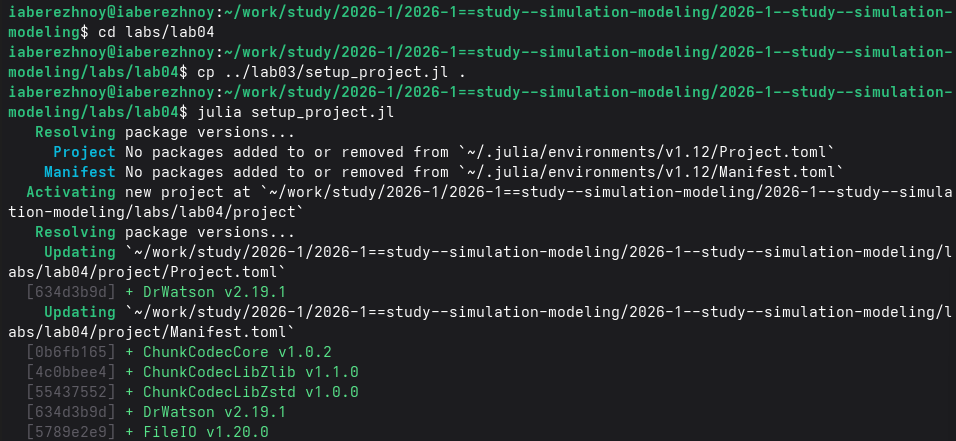{#fig-001 width=100%}

Скриптом `add_packages.jl` добавим базовые пакеты (рис. -@fig-002).

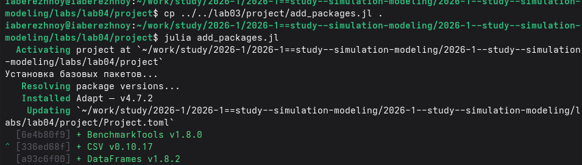{#fig-002 width=100%}

Дополнительно добавим пакеты Agents, StatsBase, Distributions и BlackBoxOptim (рис. -@fig-003).

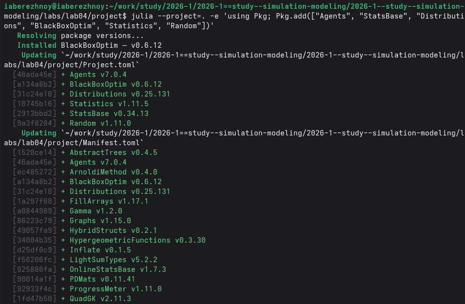{#fig-003 width=100%}

## Базовый эксперимент

Запишем код модели в файл `src/sir_model.jl`. В файле `scripts/sir_run_basic.jl` запустим один эксперимент с параметрами по умолчанию (рис. -@fig-004).

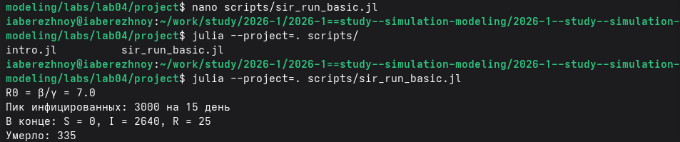{#fig-004 width=100%}

## Сканирование коэффициента заразности

В файле `scripts/sir_scan_beta.jl` заразность $\beta$ меняется от 0.1 до 1.0 с шагом 0.1. Для каждого значения выполняются три прогона с разными зёрнами генератора. Усреднённые результаты показаны на рис. -@fig-005.

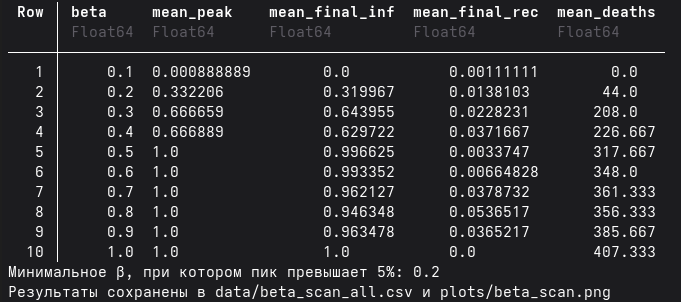{#fig-005 width=90%}

## Эффект миграции

В файле `scripts/sir_migration_effect.jl` интенсивность миграции меняется от 0 до 0.5. Инфекция начинается только в первом городе (рис. -@fig-006).

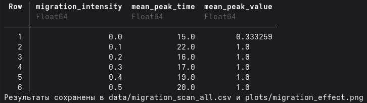{#fig-006 width=90%}

## Оптимизация параметров

В файле `scripts/sir_optimize_parameters.jl` алгоритм Borg MOEA ищет параметры, при которых малы пик заболеваемости и доля умерших (рис. -@fig-007).

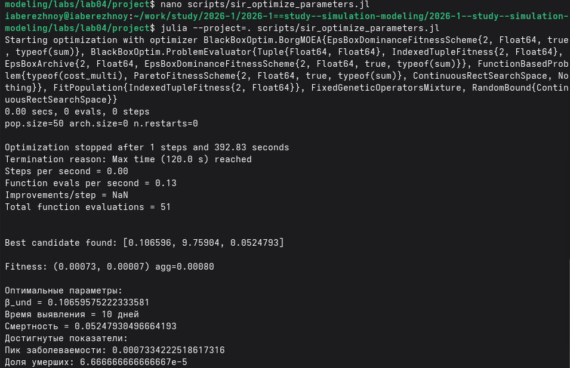{#fig-007 width=100%}

## Сводная визуализация

Скрипт `scripts/sir_visualize_dynamics.jl` загружает сохранённые результаты сканирования и строит сводный график (рис. -@fig-008).

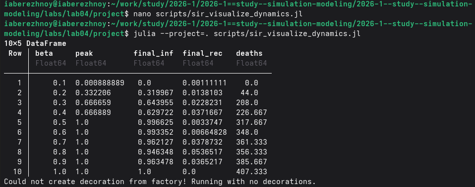{#fig-008 width=100%}

## Производные форматы

С помощью скрипта `tangle.jl` сгенерируем из пяти литературных файлов чистый код, ноутбуки и документы Quarto (рис. -@fig-009).

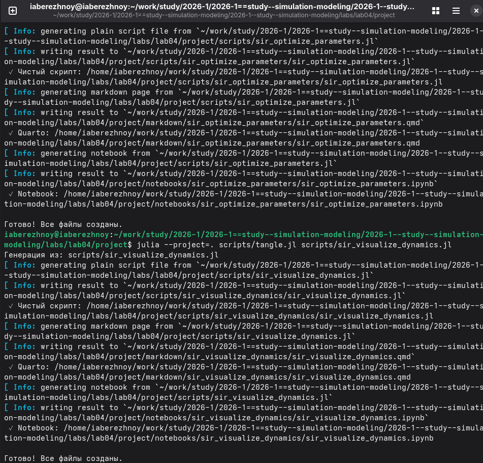{#fig-009 width=100%}

Выполним ноутбуки в Jupyter (рис. -@fig-010).

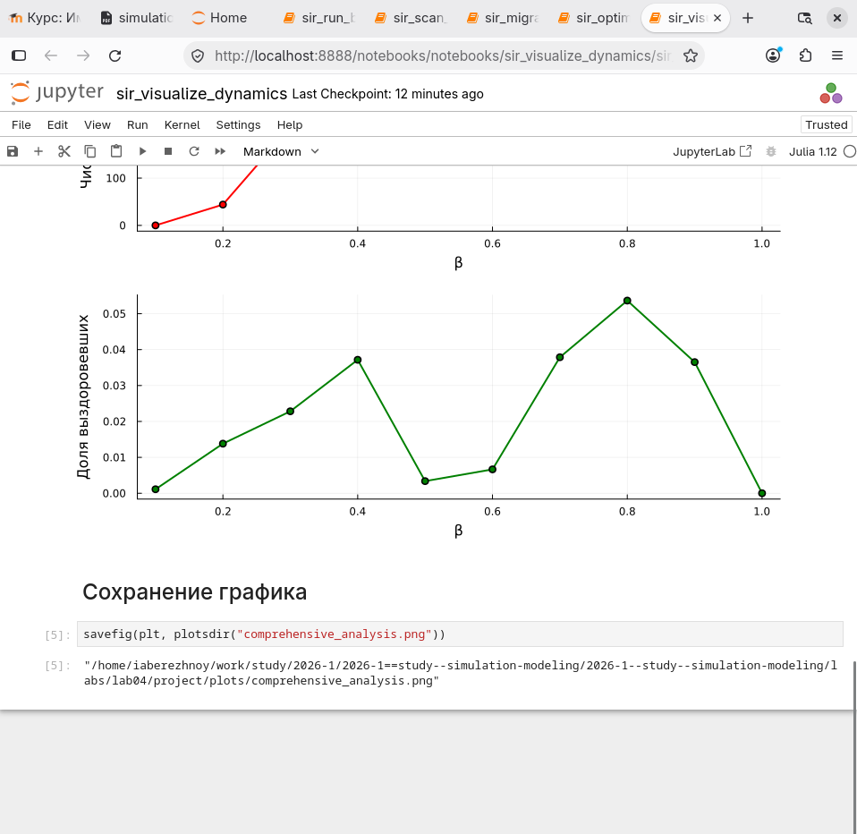{#fig-010 width=90%}

В файле `_quarto.yml` включим поддержку Julia, в преамбуле `preamble.tex` подключим шрифт JuliaMono.

# Результаты

## Базовый эксперимент

Базовое репродуктивное число $R_0 = \beta / \gamma = 0.5 \cdot 14 = 7$. Динамика показана на рис. -@fig-011.

{#fig-011 width=90%}

К 15 дню инфицированы все 3000 человек. В конце расчёта восприимчивых нет, инфицированных 2640, выздоровевших 25. Умерло 335 человек.

## Сканирование заразности

Результаты сканирования приведены в табл. -@tbl-beta и на рис. -@fig-012.

|$\beta$|Пик|Конечная доля инфицированных|Умерло|
|---:|---:|---:|---:|
|0.1|0.001|0.000|0.0|
|0.2|0.332|0.320|44.0|
|0.3|0.667|0.644|208.0|
|0.4|0.667|0.630|226.7|
|0.5|1.000|0.997|317.7|
|0.6|1.000|0.993|348.0|
|0.7|1.000|0.962|361.3|
|0.8|1.000|0.946|356.3|
|0.9|1.000|0.963|385.7|
|1.0|1.000|1.000|407.3|

: Средние показатели при разной заразности {#tbl-beta}

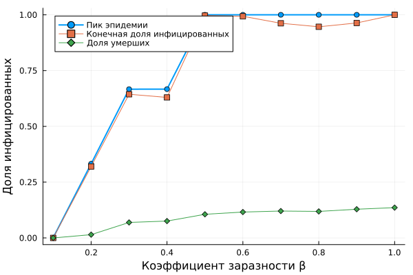{#fig-012 width=90%}

Минимальное значение $\beta$, при котором средний пик превышает 5% населения, равно 0.2.

Сводный график показан на рис. -@fig-014.

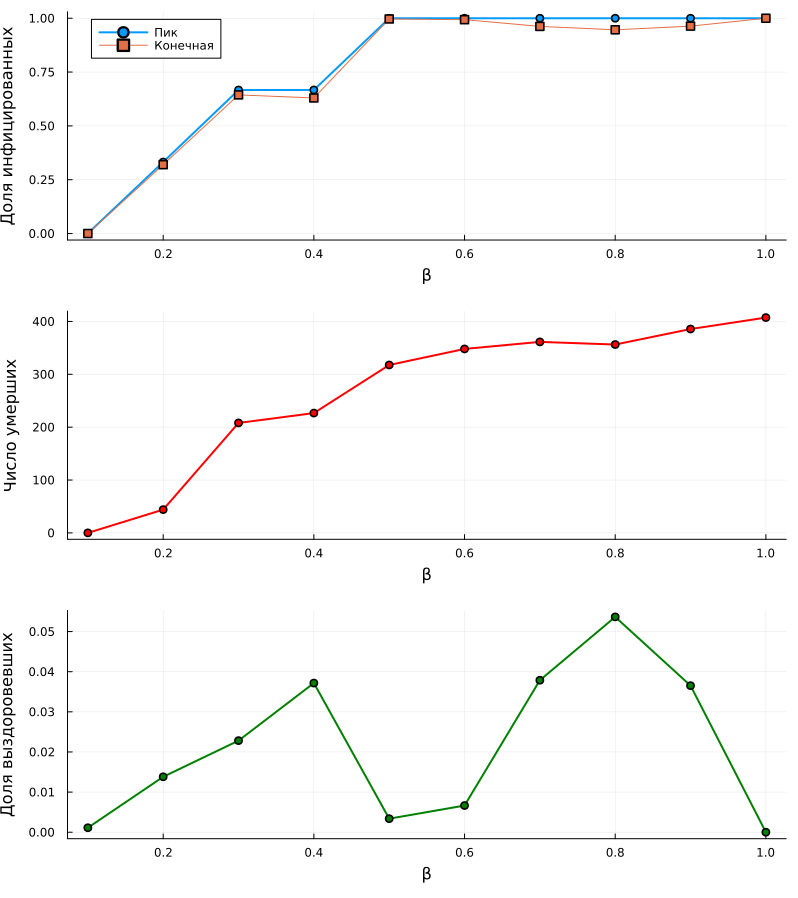{#fig-014 width=80%}

## Эффект миграции

Результаты приведены в табл. -@tbl-mig и на рис. -@fig-013.

|Интенсивность миграции|День пика|Пик|
|---:|---:|---:|
|0.0|15.0|0.333|
|0.1|22.0|1.000|
|0.2|16.0|1.000|
|0.3|17.0|1.000|
|0.4|19.0|1.000|
|0.5|20.0|1.000|

: Средние показатели при разной интенсивности миграции {#tbl-mig}

{#fig-013 width=100%}

## Оптимизация

За время работы оптимизатор выполнил 51 вычисление целевой функции. Лучший найденный набор: $\beta = 0.107$, время выявления 10 дней, вероятность смерти 0.052. При этих параметрах пик заболеваемости равен 0.0007, доля умерших --- 0.00007.

# Обсуждение результатов

В базовом эксперименте эпидемия охватывает всё население за 15 дней и не заканчивается. Причина в правиле повторного заражения. Больной перебирает соседей по городу, пока не использует все свои заражения. Когда восприимчивых не остаётся, он заражает выздоровевших с вероятностью 0.1 каждого. Соседей около тысячи, поэтому выздоровевший почти сразу заражается снова.

На графике это видно как пилообразная кривая. Почти все заразились в одни и те же дни, через 14 дней они одновременно выздоравливают и снова заражаются. Каждый такой цикл уносит около 2% населения.

Формула $R_0 = \beta / \gamma$ даёт 7. Она не учитывает, что после выявления заразность падает в 10 раз. С учётом этого один больной заражает за время болезни примерно $0.5 \cdot 6 + 0.05 \cdot 7 \approx 3.4$ человека. Это всё равно больше единицы, и эпидемия развивается.

Сканирование показывает порог между $\beta = 0.1$ и $\beta = 0.2$. Та же оценка даёт порог около $\beta = 0.15$, а формула $R_0 = 1$ без учёта выявления --- около 0.07. Наблюдаемый порог согласуется с первой оценкой.

При $\beta$ от 0.2 до 0.4 средний пик равен 0.33 и 0.67. Это не частичная эпидемия, а усреднение трёх прогонов: в одних эпидемия охватила всех, в других затухла в самом начале. При одном начальном больном исход зависит от случая. В модели на уравнениях такого эффекта нет.

Без миграции эпидемия остаётся в первом городе, и пик равен трети населения. При любой ненулевой миграции заражаются все три города. Время до пика составляет от 16 до 22 дней и не показывает ясной зависимости от интенсивности: при трёх прогонах разброс сравним с самим эффектом.

Оптимизатор выбрал почти наименьшую допустимую заразность. Это ожидаемо: при $\beta$ около 0.1 эпидемия не начинается, и оба критерия близки к нулю. Оптимизатор успел оценить только начальную популяцию решений, потому что одно вычисление целевой функции занимает около 8 секунд.

# Заключение

Модель SIR реализована в агентном подходе на Julia с помощью пакета Agents.jl. Выполнены базовый эксперимент, сканирование заразности и миграции, многокритериальная оптимизация. Для пяти скриптов получены чистый код, ноутбуки и документация Quarto.

# Список литературы {.unnumbered}

::: {#refs}
:::

\appendix










