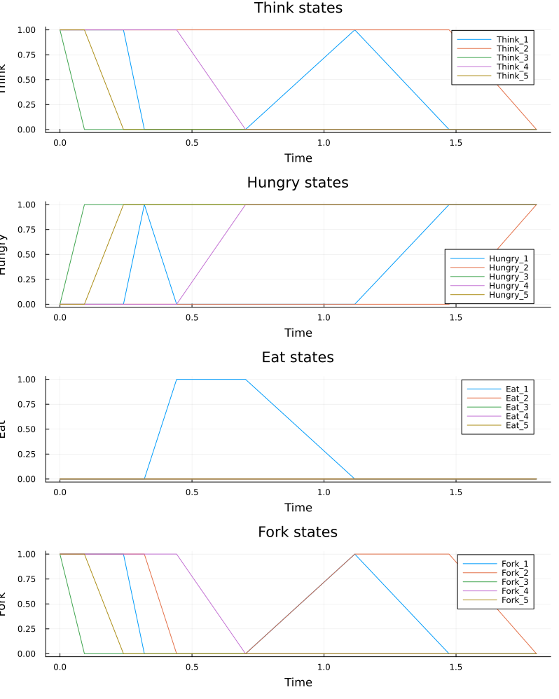

---
## Author
author:
  name: Иван Александрович Бережной
  email: 1132236041@rudn.ru
  affiliation:
    - name: Российский университет дружбы народов
      country: Российская Федерация
      postal-code: 117198
      city: Москва
      address: ул. Миклухо-Маклая, д. 6
## Title
title: "Презентация по лабораторной работе №5"
subtitle: "Имитационное моделирование"
license: CC BY
date: today
date-format: "YYYY-MM-DD" # Example: 2025-09-06
---

# Информация

## Докладчик

  * Иван Александрович Бережной
  * студент
  * Российский университет дружбы народов им. П. Лумумбы
  * 1132236041@rudn.ru

::: notes
- Представиться.
:::

# Вводная часть

## Актуальность

- Программы и процессы часто делят общие ресурсы. Если каждый захватил часть ресурсов и ждёт остальные, система зависает. Сети Петри позволяют найти такую ситуацию ещё на этапе модели.

::: notes
- Задача об обедающих философах --- классический пример того, как несколько процессов блокируют друг друга из-за общих ресурсов.
:::

## Объект и предмет исследования

- Объект: задача об обедающих философах.
- Предмет: появление блокировки в сети Петри для этой задачи.

## Цели и задачи

- Цель:
    - Построить сеть Петри, найти в ней блокировку и убрать её.
- Задачи:
    - Смоделировать обычную сеть и сеть с арбитром.
    - Провести случайное и детерминированное моделирование.
    - Повторить расчёт для набора параметров.
    - Получить из литературного кода чистый код, ноутбуки и Quarto.

## Материалы и методы

Работа выполнялась на виртуальной машине, созданной с помощью VirtualBox на ОС Fedora.

Программное обеспечение:

- Julia с DrWatson, OrdinaryDiffEq.
- Quarto, TeX Live.

# Выполнение работы

## Сеть Петри

- Позиции --- состояния и ресурсы, в них лежат фишки.
- Переходы --- события, которые перекладывают фишки.
- Переход срабатывает, когда во всех входных позициях есть фишки.
- Блокировка --- состояние, в котором не может сработать ни один переход.

::: notes
Срабатывание перехода меняет число фишек по матрице инцидентности.
:::

## Обедающие философы

- За столом $N$ философов, между соседями по одной вилке. Чтобы поесть, нужны две вилки.
- Позиции: `Think`, `Hungry`, `Eat`, `Fork`.
- Переходы: `GetLeft`, `GetRight`, `PutForks`.
- Если все взяли левую вилку, все ждут друг друга.

## Сеть с арбитром

- Добавлена позиция `Arbiter` с $N - 1$ фишками. Философ забирает фишку вместе с левой вилкой и возвращает, когда кладёт вилки.
- Левую вилку держат не больше $N - 1$ философов, поэтому одна вилка всегда свободна.

## Скрипты

- Модуль `DiningPhilosophers.jl` с общим кодом сети.
- Основной расчёт для $N = 5$.
- Анимация для $N = 3$.
- Итоговый график.
- Расчёт для набора параметров: $N$ равно 3, 5 и 7, по 20 запусков.

# Результаты

## Обычная сеть

:::::::::::::: {.columns align=center}
::: {.column width="45%"}

Блокировка наступила после 8 событий в момент $t \approx 1.8$, и поесть успел только первый философ.

:::
::: {.column width="55%"}

{height=75%}

:::
::::::::::::::

## Сеть с арбитром

:::::::::::::: {.columns align=center}
::: {.column width="45%"}

Блокировки нет: за время моделирования произошло 77 событий, и философы ели по очереди до конца.

:::
::: {.column width="55%"}

{height=75%}

:::
::::::::::::::

## Детерминированная модель

:::::::::::::: {.columns align=center}
::: {.column width="45%"}

Кривые быстро выходят на постоянные значения: `Think` и `Hungry` около 0.434, `Eat` около 0.131. Блокировку эта модель не показывает.

:::
::: {.column width="55%"}

{height=75%}

:::
::::::::::::::

::: notes
Фишки здесь дробные, поэтому модель даёт только средние значения.
:::

## Сравнение двух сетей

{height=70%}

## Набор параметров

{height=55%}

Обычная сеть зависла во всех запусках, а сеть с арбитром ни разу. С арбитром получается около 25 приёмов пищи при любом $N$.

::: notes
Провал при N = 5 на левом графике --- случайный разброс, потому что 20 запусков мало.
:::

# Заключение

## Главный вывод

- Обычная сеть всегда приходит к блокировке. Арбитр эту блокировку убирает, но есть одновременно может только один философ.
- Детерминированная модель блокировку не находит.
- Из литературного кода получены чистый код, ноутбуки и документация Quarto.

::: notes
- Поблагодарить устно и перейти к вопросам.
:::
