---
## Author
author:
  name: Иван Александрович Бережной
  email: 1132236041@rudn.ru
  affiliation:
    - name: Российский университет дружбы народов
      country: Российская Федерация
      postal-code: 117198
      city: Москва
      address: ул. Миклухо-Маклая, д. 6
## Title
title: "Отчёт по лабораторной работе №5"
subtitle: "Имитационное моделирование"
license: "CC BY"
abstract: |
  В работе с помощью сетей Петри смоделирована задача об обедающих философах. Показано, что обычная сеть зависает, а сеть с арбитром --- нет.

keywords: [лабораторная работа, Julia, сети Петри, обедающие философы, deadlock]
---

# Введение

## Цель работы

Построить сеть Петри для задачи об обедающих философах, найти в ней взаимную блокировку (deadlock) и изменить сеть так, чтобы блокировки не было.

## Задачи

- Создать рабочий каталог для кода.
- Установить необходимые пакеты.
- Выполнить предложенный код.
- Преобразовать код в литературный стиль.
- Сгенерировать из литературного кода:
    - чистый код;
    - jupyter notebook;
    - документацию в формате Quarto.
- Выполнить код из jupyter notebook.
- Интегрировать документацию в формате Quarto в отчёт.
- Добавить в код в литературном стиле вычисление для набора параметров.
- Сгенерировать из литературного кода с параметрами:
    - чистый код;
    - jupyter notebook;
    - документацию в формате Quarto.
- Выполнить код из jupyter notebook с параметрами.
- Интегрировать документацию с параметрами в формате Quarto в отчёт.

## Объект и предмет исследования

Объект исследования --- задача об обедающих философах.

Предмет исследования --- появление блокировки в сети Петри для этой задачи.

## Методы исследования

- Сети Петри.
- Случайное моделирование (алгоритм Гиллеспи).
- Решение дифференциальных уравнений.
- Расчёт для набора параметров.

## Схема выполнения работы

На рис. -@fig-flowchart представлена общая последовательность действий при выполнении работы.

::: {#fig-flowchart}

```{mermaid}
%%| fig-width: 100%
graph TD
    A@{ shape: circle, label: "Начало" } --> B[Создать проект и установить пакеты]
    B --> C[Запустить моделирование двух сетей]
    C --> D[Построить анимацию и итоговый график]
    D --> E[Добавить набор параметров]
    E --> F[Сгенерировать чистый код, ноутбуки и Quarto]
    F --> G@{ shape: dbl-circ, label: "Конец" }
```

Блок-схема выполнения лабораторной работы

:::

# Теоретическая часть

Сеть Петри состоит из позиций и переходов.
Позиции --- это состояния и ресурсы, в них лежат фишки.
Переходы --- это события.
Переход может сработать, если во всех его входных позициях есть фишки.
При срабатывании он забирает фишки из входных позиций и кладёт в выходные:

$$
M' = M + C e_j,
$$ {#eq-firing}

где $M$ --- число фишек в позициях, $C$ --- матрица инцидентности, $j$ --- номер перехода.

Блокировка (deadlock) --- это состояние, в котором не может сработать ни один переход.

В задаче за круглым столом сидят $N$ философов, между соседями лежит по одной вилке.
Чтобы поесть, нужны две вилки.
У каждого философа есть позиции `Think` (думает), `Hungry` (взял левую вилку и ждёт правую), `Eat` (ест) и `Fork` (вилка свободна).
Переходов три: `GetLeft` (взять левую вилку), `GetRight` (взять правую), `PutForks` (положить обе).

Если все философы взяли левую вилку, свободных вилок не остаётся и все ждут друг друга.
Это и есть блокировка.

Чтобы её убрать, добавляют позицию `Arbiter` с $N - 1$ фишками.
Философ забирает фишку, когда берёт левую вилку, и возвращает, когда кладёт вилки.
Тогда левую вилку держат не больше $N - 1$ философов, и одна вилка всегда свободна.

В алгоритме Гиллеспи время до следующего события случайное:

$$
\tau = -\frac{\ln r}{a_0},
$$ {#eq-gillespie}

где $r$ --- случайное число от 0 до 1, $a_0$ --- сумма интенсивностей всех разрешённых переходов.
Какой переход сработает, тоже выбирается случайно.

В детерминированной модели число фишек считается непрерывным и решается уравнение

$$
\frac{du}{dt} = C\, a(u).
$$ {#eq-ode}

# Материалы и методы

Работа выполнялась на виртуальной машине, созданной с помощью VirtualBox, на ОС Fedora.

Программное обеспечение:

- git, git-flow.
- Julia с DrWatson, OrdinaryDiffEq.
- Quarto, TeX.

# Выполнение лабораторной работы

Работа выполнялась по методическим указаниям [@simmod_lab05].

## Создание проекта

В каталоге лабораторной работы создадим проект DrWatson (рис. -@fig-001).

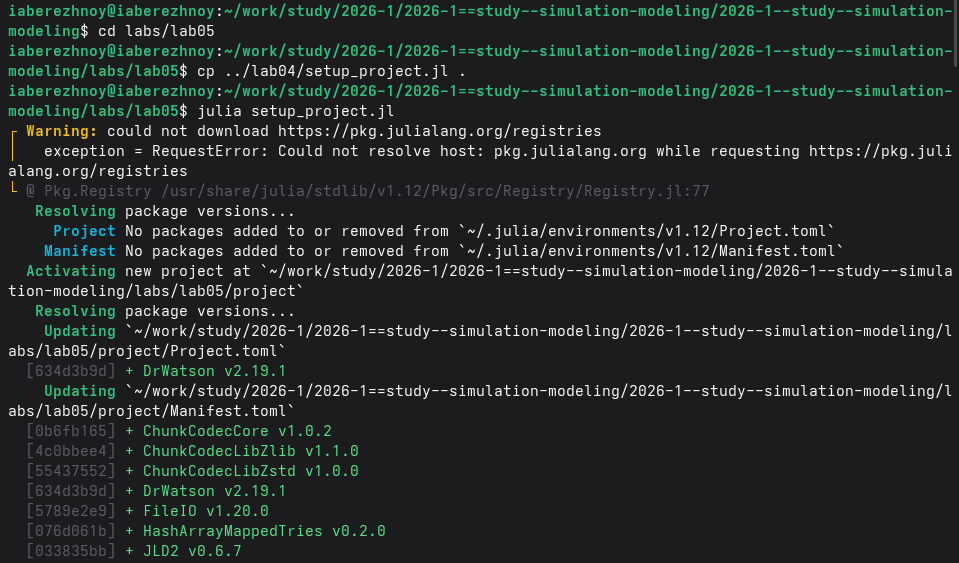{#fig-001 width=100%}

Скриптом `add_packages.jl` добавим базовые пакеты (рис. -@fig-002).

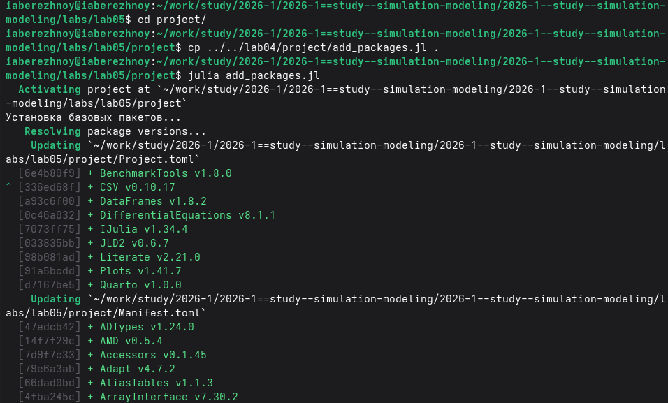{#fig-002 width=100%}

Дополнительно добавим пакеты (рис. -@fig-003).

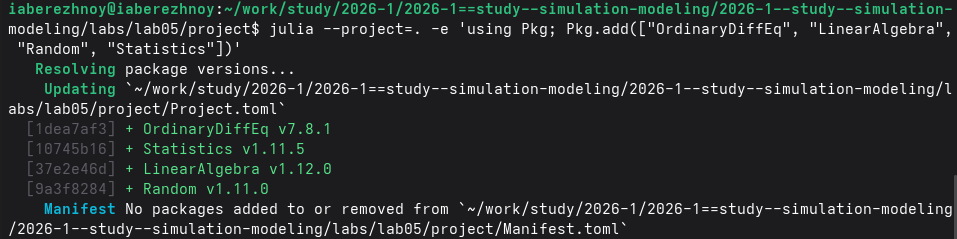{#fig-003 width=100%}

## Основной расчёт

Общий код сети Петри лежит в модуле `src/DiningPhilosophers.jl`.  
Основной скрипт моделирует обычную сеть и сеть с арбитром и проверяет блокировку (рис. -@fig-004).

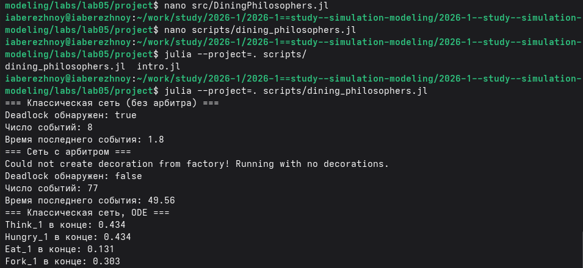{#fig-004 width=100%}

## Анимация

Второй скрипт строит анимацию для трёх философов и сохраняет её (рис. -@fig-005).

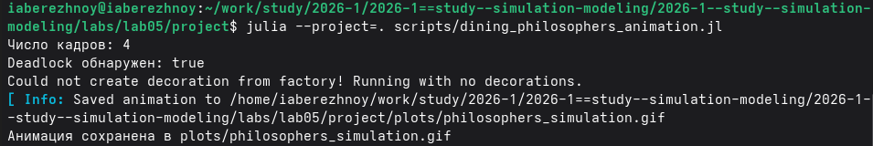{#fig-005 width=100%}

## Итоговый график

Третий скрипт строит общий график для двух сетей (рис. -@fig-006).

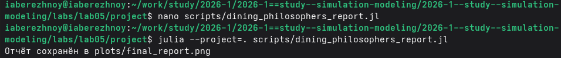{#fig-006 width=100%}

## Расчёт для набора параметров

Моделирование случайное, поэтому повторим его для разного числа философов и разных зёрен (рис. -@fig-007).

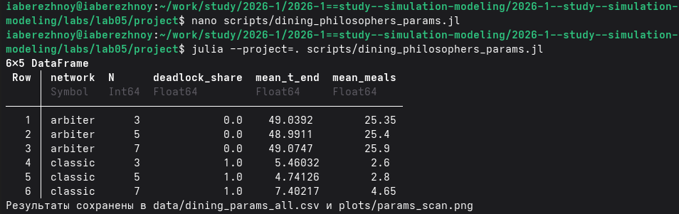{#fig-007 width=100%}

## Генерация кода, ноутбуков и документации

Из каждого скрипта получим чистый код, ноутбук и документ Quarto (рис. -@fig-008).

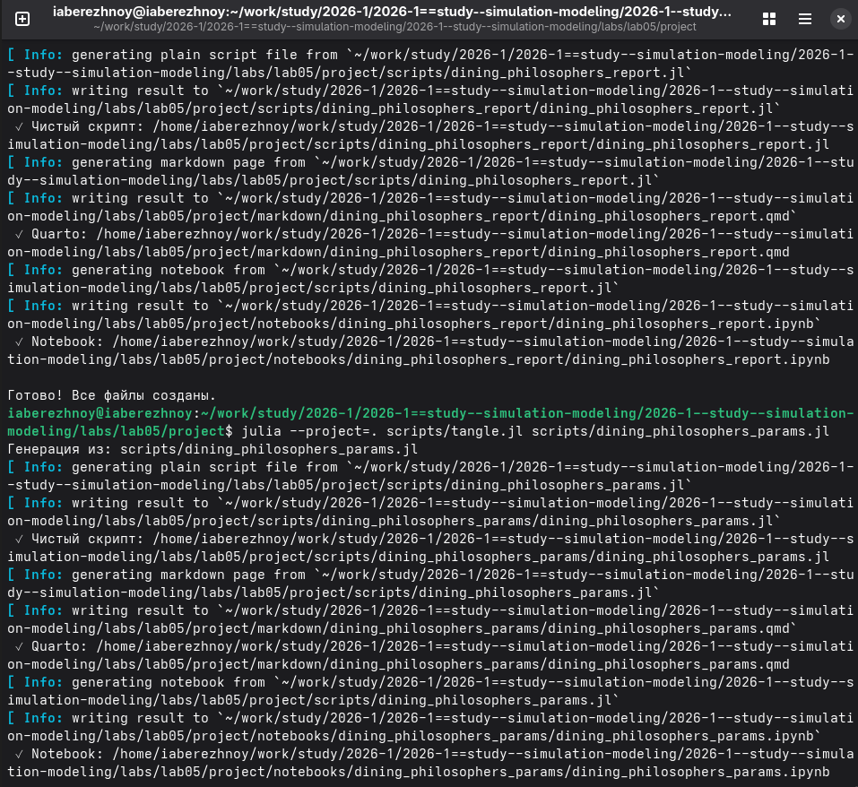{#fig-008 width=100%}

Выполним ноутбуки Jupyter (рис. -@fig-009).

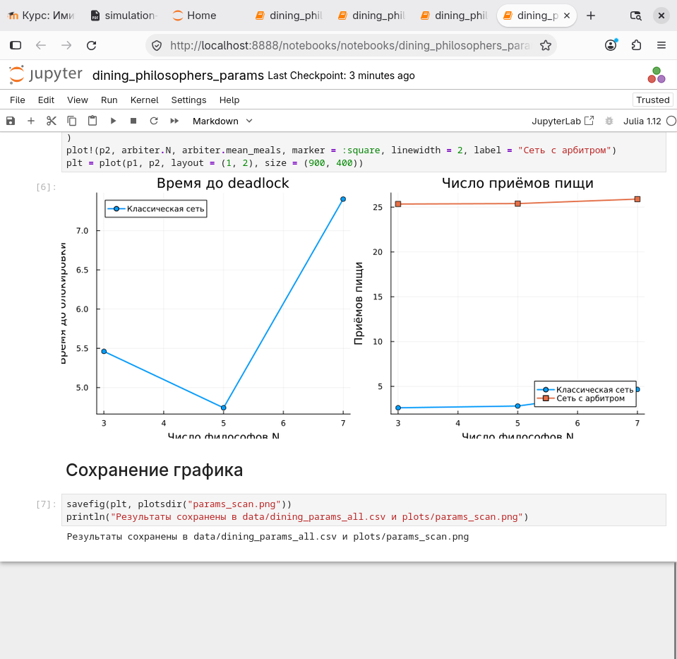{#fig-009 width=100%}

Документы Quarto подключены в приложении.

# Результаты

Обычная сеть зависла после 8 событий в момент $t \approx 1.8$ (рис. -@fig-010). Поесть успел только первый философ.

{#fig-010 width=100%}

Сеть с арбитром не зависла: произошло 77 событий, последнее в момент $t \approx 49.56$ (рис. -@fig-011).

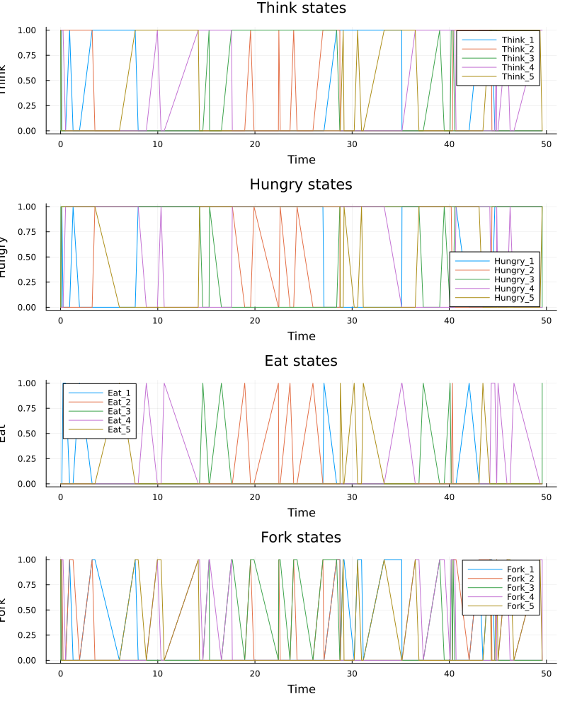{#fig-011 width=100%}

В детерминированной модели все кривые быстро выходят на постоянные значения: `Think` и `Hungry` около 0.434, `Eat` около 0.131, `Fork` около 0.303 (рис. -@fig-012).

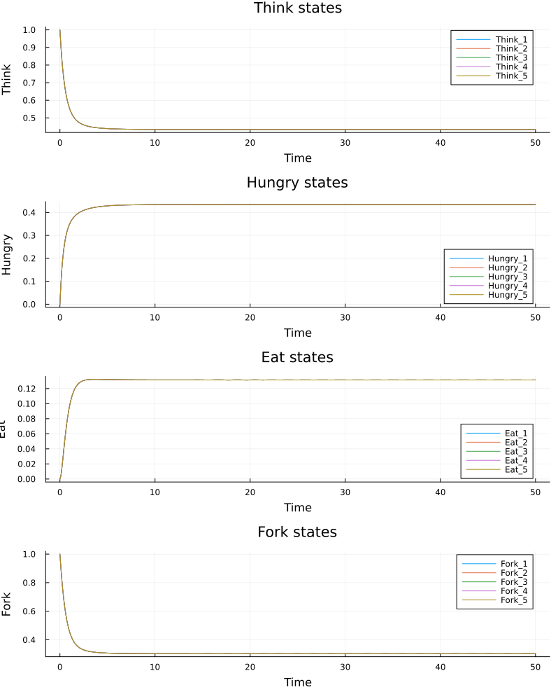{#fig-012 width=100%}

На рис. -@fig-013 видно, кто и когда ест.  
В обычной сети один приём пищи, в сети с арбитром философы едят всё время.

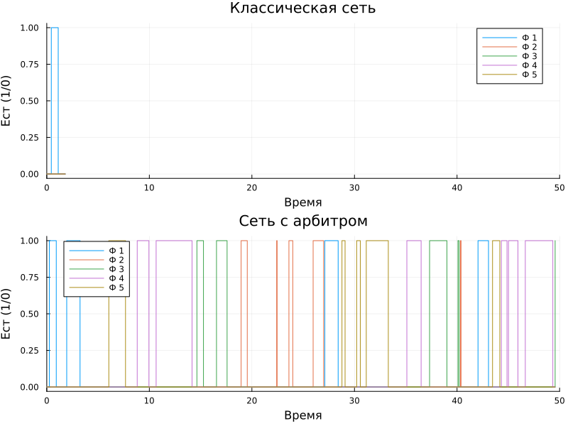{#fig-013 width=100%}

Анимация получилась из четырёх кадров: три философа сразу взяли по левой вилке, и сеть зависла.

Результаты для набора параметров приведены в табл. -@tbl-params и на рис. -@fig-014.

|Сеть|$N$|Доля блокировок|Время последнего события|Приёмов пищи|
|---|---|---|---|---|
|Обычная|3|1.0|5.46|2.60|
|Обычная|5|1.0|4.74|2.80|
|Обычная|7|1.0|7.40|4.65|
|С арбитром|3|0.0|49.04|25.35|
|С арбитром|5|0.0|48.99|25.40|
|С арбитром|7|0.0|49.07|25.90|

: Средние результаты по 20 запускам {#tbl-params}

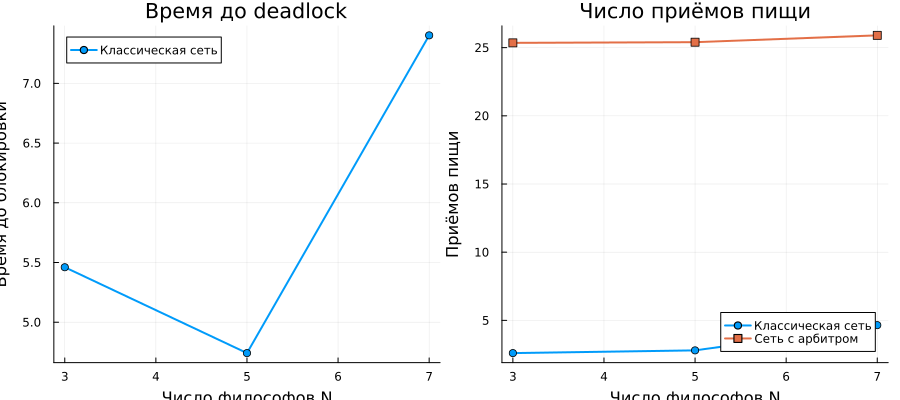{#fig-014 width=100%}

# Обсуждение результатов

Обычная сеть зависла во всех запусках. Это свойство самой сети: рано или поздно все берут по левой вилке.

Сеть с арбитром не зависла ни разу.

Время до блокировки при $N = 5$ вышло меньше, чем при $N = 3$. Это случайный разброс: 20 запусков мало.

Число приёмов пищи с арбитром почти не зависит от $N$, так как почти всё время свободна только одна вилка, и есть может только один философ.

Детерминированная модель блокировку не показывает. В ней фишки дробные, и она даёт только средние значения.

# Заключение

Цель достигнута: сети Петри построены, моделирование проведено. Обычная сеть приходит к блокировке, в то время как арбитр блокировку убирает. Детерминированная модель блокировку не находит.  
Из литературного кода получены чистый код, ноутбуки и документации Quarto.

# Список литературы {.unnumbered}

::: {#refs}
:::

\appendix








