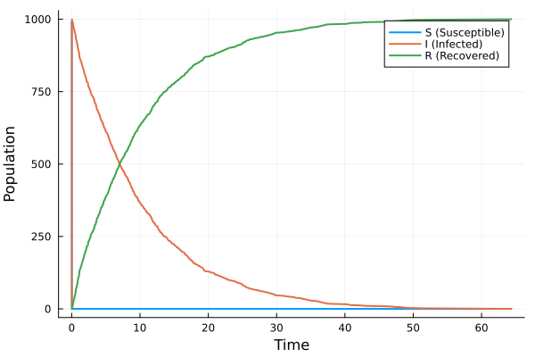
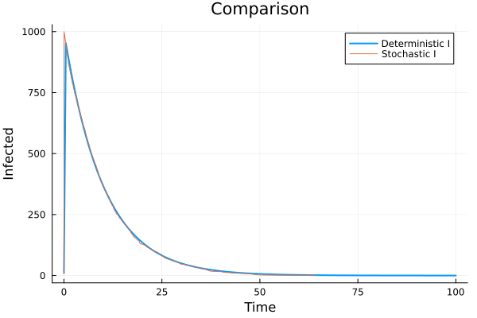
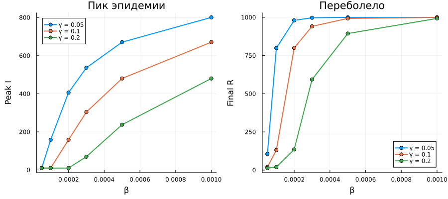

---
## Author
author:
  name: Иван Александрович Бережной
  email: 1132236041@rudn.ru
  affiliation:
    - name: Российский университет дружбы народов
      country: Российская Федерация
      postal-code: 117198
      city: Москва
      address: ул. Миклухо-Маклая, д. 6
## Title
title: "Презентация по лабораторной работе №6"
subtitle: "Имитационное моделирование"
license: CC BY
date: today
date-format: "YYYY-MM-DD" # Example: 2025-09-06
---

# Информация

## Докладчик

  * Иван Александрович Бережной
  * студент
  * Российский университет дружбы народов им. П. Лумумбы
  * 1132236041@rudn.ru

::: notes
- Представиться.
:::

# Вводная часть

## Актуальность

Модели эпидемий помогают заранее оценить, сколько людей заболеет и когда наступит пик. Сети Петри позволяют записать такую модель наглядно, в виде состояний и переходов между ними, а затем считать её разными способами.

## Объект и предмет исследования

- Объект: модель эпидемии SIR.
- Предмет: поведение этой модели, записанной в виде сети Петри, при разных значениях параметров.

## Цели и задачи

- Цель:
    - Реализовать модель SIR в виде сети Петри и исследовать её.
- Задачи:
    - Провести детерминированное и стохастическое моделирование.
    - Проверить, как результат зависит от коэф. заражения.
    - Повторить расчёт для набора параметров.
    - Получить из литературного кода чистый код, ноутбуки и Quarto.

## Материалы и методы

Работа выполнялась на виртуальной машине, созданной с помощью VirtualBox на ОС Fedora.

Программное обеспечение:

- Julia с DrWatson, AlgebraicPetri, Catlab, OrdinaryDiffEq.
- Quarto, TeX Live.

# Выполнение работы

## Модель SIR как сеть Петри

- Три позиции: $S$ --- здоровые, $I$ --- больные, $R$ --- переболевшие.
- Переход "заражение" забирает по фишке из $S$ и $I$ и кладёт две фишки в $I$, а переход "выздоровление" перекладывает фишку из $I$ в $R$.
- В начале 990 здоровых и 10 больных.

## Два способа расчёта

$$
\frac{dS}{dt} = -\beta S I, \quad
\frac{dI}{dt} = \beta S I - \gamma I, \quad
\frac{dR}{dt} = \gamma I
$$

- В детерминированной модели по сети строится система уравнений, которая решается методом Tsit5.
- В стохастической модели те же переходы срабатывают как случайные события по алгоритму Гиллеспи.

## Скрипты

- Модуль `SIRPetri.jl` содержит сеть и обе симуляции.
- Базовый прогон выполняется при $\beta = 0.3$ и $\gamma = 0.1$.
- Отдельные скрипты сканируют $\beta$ от 0.1 до 0.8, строят анимацию и итоговые графики.
- Последний скрипт считает набор параметров: 6 значений $\beta$ и 3 значения $\gamma$.

# Результаты

## Детерминированная модель

:::::::::::::: {.columns align=center}
::: {.column width="40%"}

Почти все здоровые заражаются в самом начале, поэтому число больных сразу поднимается до пика около 952.69, а затем плавно убывает. К концу переболело практически всё население.

:::
::: {.column width="60%"}

{width=100%}

:::
::::::::::::::

## Стохастическая модель

:::::::::::::: {.columns align=center}
::: {.column width="40%"}

В случайной модели произошло 1990 событий, а последний больной выздоровел в момент $t \approx 64.35$. Картина получилась такой же, только кривые стали немного неровными.

:::
::: {.column width="60%"}

{width=100%}

:::
::::::::::::::

## Сравнение двух моделей

:::::::::::::: {.columns align=center}
::: {.column width="40%"}

Кривые числа больных почти совпадают, потому что население большое и случайные отклонения на его фоне малы.

:::
::: {.column width="60%"}

{width=100%}

:::
::::::::::::::

## Сканирование по $\beta$

:::::::::::::: {.columns align=center}
::: {.column width="40%"}

При любом $\beta$ от 0.1 до 0.8 переболевает всё население, а пик почти не меняется. Скорость заражения $\beta S I$ при тысяче человек настолько велика, что порог эпидемии здесь не виден.

:::
::: {.column width="60%"}

{width=100%}

:::
::::::::::::::

## Набор параметров

{height=55%}

При маленьких $\beta$ порог виден: пока $R_0 = \beta N / \gamma$ не больше единицы, эпидемии нет, а при $R_0 > 1$ начинается вспышка.

::: notes
- Чем больше R0, тем выше пик и тем раньше он наступает.
:::

# Заключение

## Главный вывод

- Модель SIR записана в виде сети Петри и посчитана двумя способами, результаты которых почти совпали.
- При параметрах из методических указаний заражается всё население независимо от $\beta$, а порог эпидемии проявляется только при малых $\beta$.
- Из литературного кода получены чистый код, ноутбуки и документация Quarto.

::: notes
- Поблагодарить устно и перейти к вопросам.
:::
