---
## Author
author:
  name: Иван Александрович Бережной
  email: 1132236041@rudn.ru
  affiliation:
    - name: Российский университет дружбы народов
      country: Российская Федерация
      postal-code: 117198
      city: Москва
      address: ул. Миклухо-Маклая, д. 6
## Title
title: "Отчёт по лабораторной работе №6"
subtitle: "Имитационное моделирование"
license: "CC BY"
abstract: |
  В работе модель эпидемии SIR записана в виде сети Петри и исследована двумя способами: через дифференциальные уравнения и через случайное моделирование.

keywords: [лабораторная работа, Julia, сети Петри, модель SIR, алгоритм Гиллеспи]
---

# Введение

## Цель работы

Реализовать модель эпидемии SIR в виде сети Петри, провести детерминированное и стохастическое моделирование и посмотреть, как результат зависит от параметров.

## Задачи

- Создать рабочий каталог для кода.
- Установить необходимые пакеты.
- Выполнить предложенный код.
- Преобразовать код в литературный стиль.
- Сгенерировать из литературного кода:
    - чистый код;
    - jupyter notebook;
    - документацию в формате Quarto.
- Выполнить код из jupyter notebook.
- Интегрировать документацию в формате Quarto в отчёт.
- Добавить в код в литературном стиле вычисление для набора параметров.
- Сгенерировать из литературного кода с параметрами:
    - чистый код;
    - jupyter notebook;
    - документацию в формате Quarto.
- Выполнить код из jupyter notebook с параметрами.
- Интегрировать документацию с параметрами в формате Quarto в отчёт.

## Объект и предмет исследования

Объект исследования --- модель эпидемии SIR.

Предмет исследования --- поведение этой модели, записанной в виде сети Петри, при разных значениях параметров.

## Методы исследования

- Сети Петри.
- Решение дифференциальных уравнений.
- Случайное моделирование (алгоритм Гиллеспи).
- Расчёт для набора параметров.

## Схема выполнения работы

На рис. -@fig-flowchart представлена общая последовательность действий при выполнении работы.

::: {#fig-flowchart}

```{mermaid}
%%| fig-width: 100%
graph TD
    A@{ shape: circle, label: "Начало" } --> B[Создать проект и установить пакеты]
    B --> C[Выполнить базовый прогон модели]
    C --> D[Просканировать параметр β]
    D --> E[Построить анимацию и итоговые графики]
    E --> F[Добавить набор параметров]
    F --> G[Сгенерировать чистый код, ноутбуки и Quarto]
    G --> H@{ shape: dbl-circ, label: "Конец" }
```

Блок-схема выполнения лабораторной работы

:::

# Теоретическая часть

В модели SIR население делится на три группы: $S$ --- здоровые, которые могут заразиться, $I$ --- больные и $R$ --- переболевшие, которые больше не заражаются.

В виде сети Петри эта модель состоит из трёх позиций $S$, $I$, $R$ и двух переходов.
Переход заражения забирает по одной фишке из $S$ и $I$ и кладёт две фишки в $I$, то есть здоровый человек при встрече с больным сам становится больным.
Переход выздоровления перекладывает фишку из $I$ в $R$.

Скорость каждого перехода пропорциональна числу фишек в его входных позициях, поэтому в детерминированном случае получается система уравнений

$$
\frac{dS}{dt} = -\beta S I, \quad
\frac{dI}{dt} = \beta S I - \gamma I, \quad
\frac{dR}{dt} = \gamma I,
$$ {#eq-sir}

где $\beta$ --- коэффициент заражения, а $\gamma$ --- коэффициент выздоровления.

Эпидемия развивается только тогда, когда число больных растёт, а для этого нужно, чтобы выполнялось условие

$$
R_0 = \frac{\beta N}{\gamma} > 1,
$$ {#eq-r0}

где $N$ --- размер населения.

В стохастическом случае те же два перехода срабатывают как случайные события, и время между событиями выбирается по алгоритму Гиллеспи.

# Материалы и методы

Работа выполнялась на виртуальной машине, созданной с помощью VirtualBox, на ОС Fedora.

Программное обеспечение:

- git, git-flow.
- Julia с DrWatson, AlgebraicPetri, Catlab, OrdinaryDiffEq.
- Quarto, TeX Live.

# Выполнение лабораторной работы

Работа выполнялась по методическим указаниям [@simmod_lab06].

## Создание проекта

В каталоге лабораторной работы создадим проект DrWatson (рис. -@fig-001), после чего скриптом `add_packages` добавим базовые пакеты.

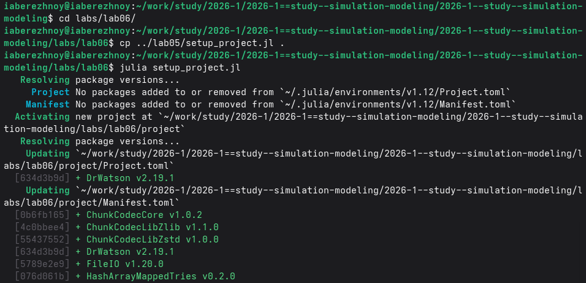{#fig-001 width=100%}

Дополнительно добавим пакеты (рис. -@fig-002).

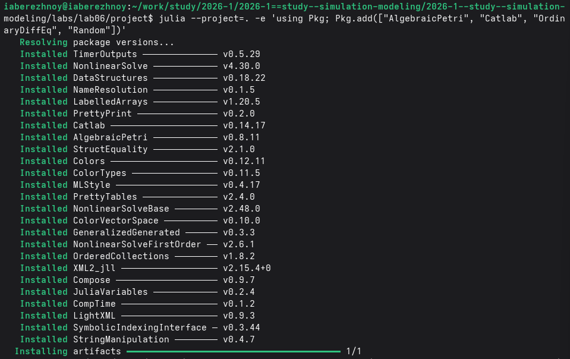{#fig-002 width=100%}

## Базовый прогон

Код модели лежит в модуле `src/SIRPetri.jl`. Основной скрипт строит сеть при $\beta = 0.3$ и $\gamma = 0.1$ и запускает детерминированную и стохастическую симуляцию (рис. -@fig-003).

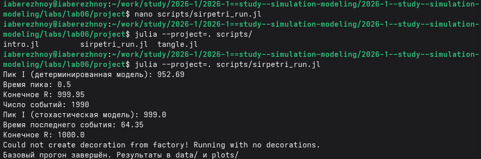{#fig-003 width=100%}

## Сканирование по $\beta$

Второй скрипт запускает детерминированную модель для 15 значений $\beta$ от 0.1 до 0.8 (рис. -@fig-004).

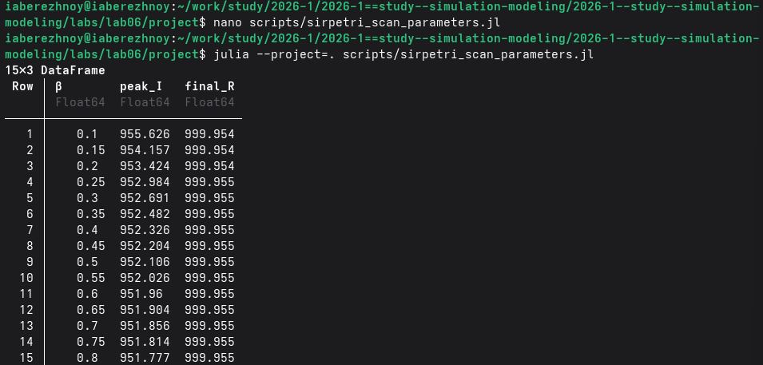{#fig-004 width=100%}

## Анимация

Третий скрипт строит анимацию из 101 кадра, на которой видно, как меняется число людей в каждой группе (рис. -@fig-005).

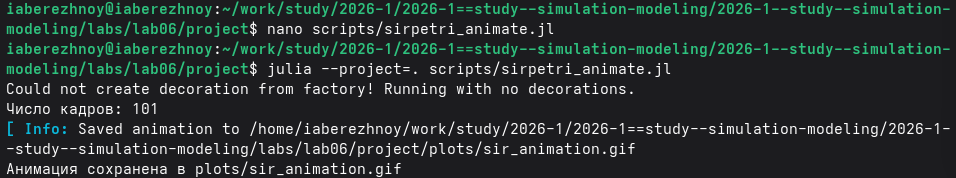{#fig-005 width=100%}

## Итоговые графики

Четвёртый скрипт читает сохранённые таблицы и строит по ним два графика (рис. -@fig-006).

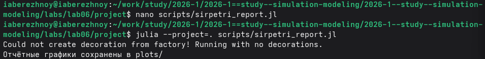{#fig-006 width=100%}

## Расчёт для набора параметров

Пятый скрипт перебирает 6 значений $\beta$ и 3 значения $\gamma$, всего 18 запусков (рис. -@fig-007).

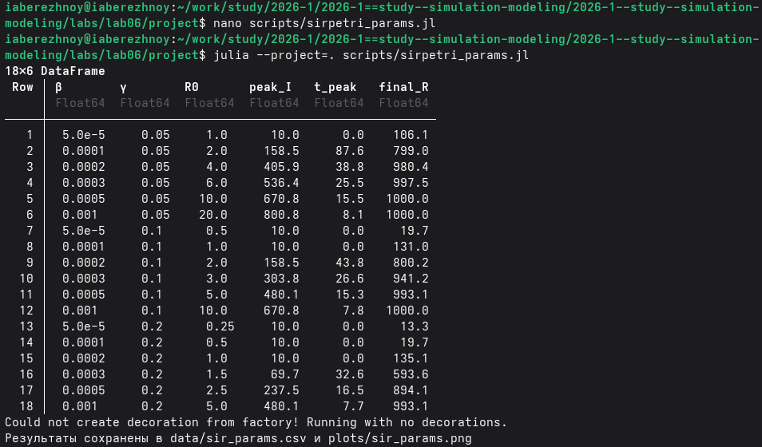{#fig-007 width=100%}

## Генерация кода, ноутбуков и документации

Из каждого скрипта получим чистый код, ноутбук и документ Quarto (рис. -@fig-008).

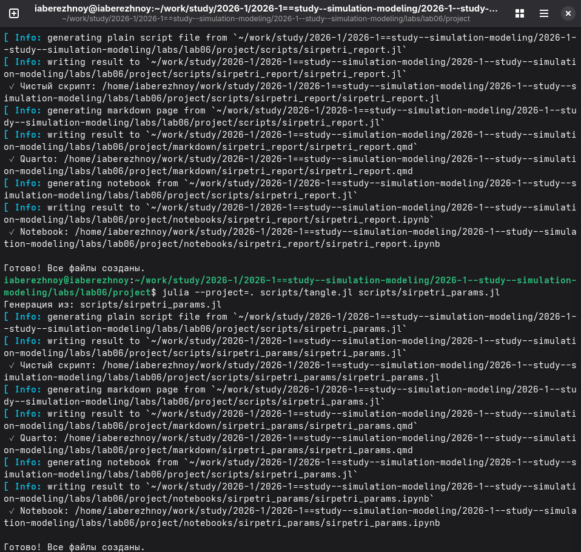{#fig-008 width=100%}

Выполним ноутбуки Jupyter (рис. -@fig-009).

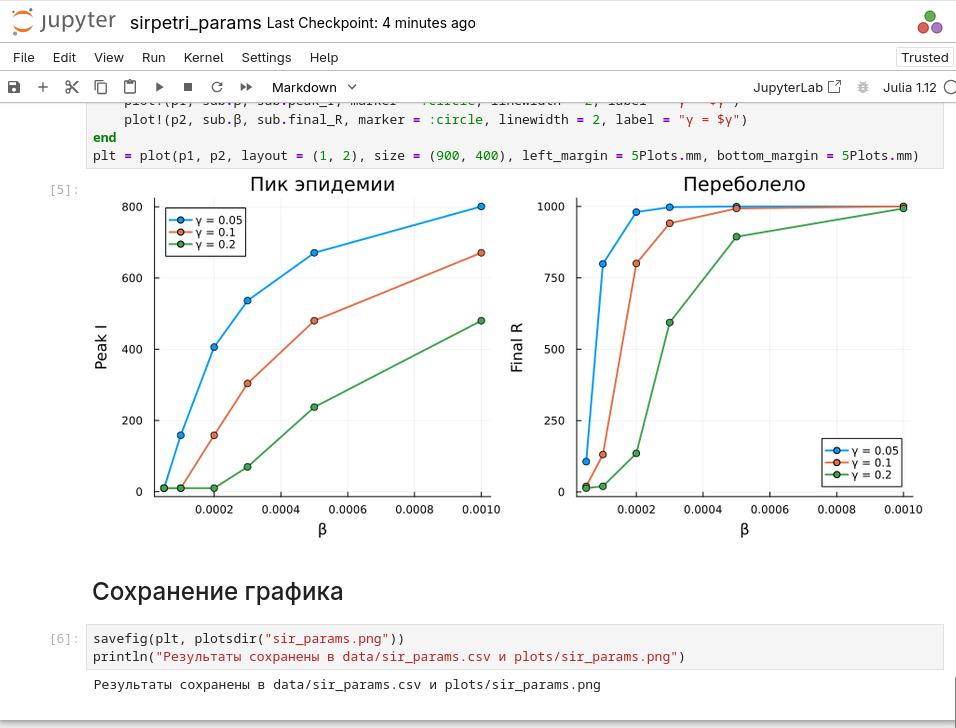{#fig-009 width=100%}

Документы Quarto подключены в приложении.

# Результаты

В детерминированной модели почти все здоровые заражаются в самом начале, поэтому число больных сразу поднимается до пика около 952.69, а дальше плавно убывает (рис. -@fig-011).
К концу моделирования переболело практически всё население: $R \approx 999.95$.

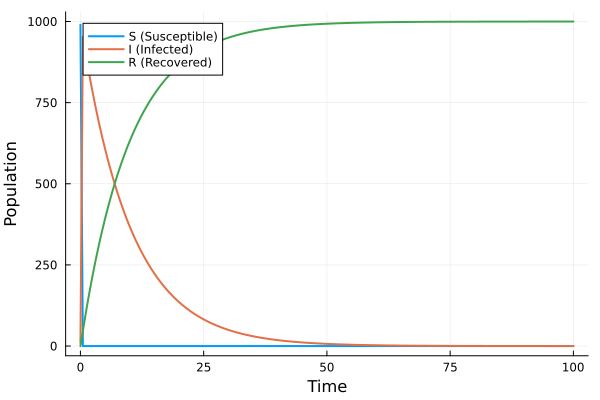{#fig-011 width=80%}

В стохастической модели произошло 1990 событий, пик числа больных составил 999, а последнее событие случилось в момент $t \approx 64.35$, когда выздоровел последний больной (рис. -@fig-012).

{#fig-012 width=80%}

Если наложить число больных из двух моделей на один график, то кривые почти совпадают (рис. -@fig-013).

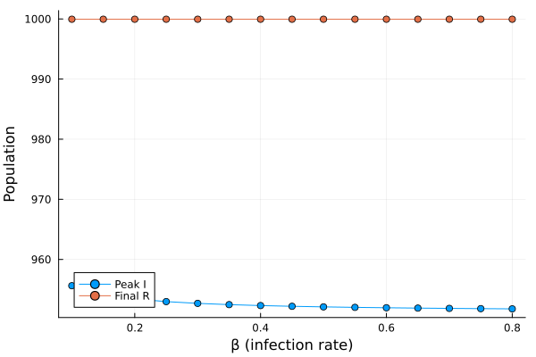{#fig-013 width=80%}

При сканировании по $\beta$ результат почти не меняется: во всех 15 запусках переболело всё население, а пик лежит в пределах от 951.78 до 955.63 (рис. -@fig-014 и рис. -@fig-015).

{#fig-014 width=80%}

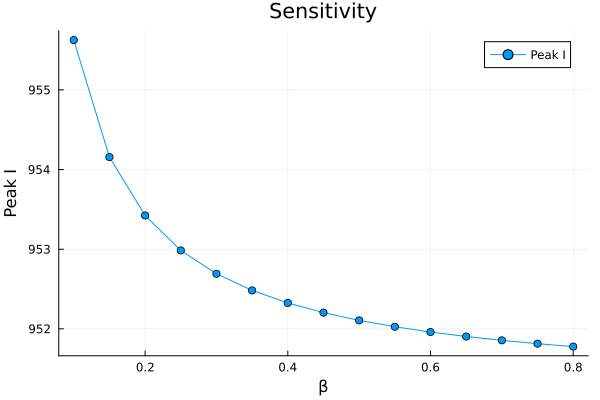{#fig-015 width=80%}

Анимация показывает то же самое в движении: столбец $S$ исчезает уже на втором кадре, после чего столбец $I$ постепенно уменьшается, а столбец $R$ растёт.

Результаты для набора параметров приведены в табл. -@tbl-params и на рис. -@fig-016.

|$\beta$|$\gamma$|$R_0$|Пик $I$|Время пика|Конечное $R$|
|---|---|---|---|---|---|
|0.00005|0.05|1.0|10.0|0.0|106.1|
|0.0001|0.05|2.0|158.5|87.6|799.0|
|0.0002|0.05|4.0|405.9|38.8|980.4|
|0.0003|0.05|6.0|536.4|25.5|997.5|
|0.0005|0.05|10.0|670.8|15.5|1000.0|
|0.001|0.05|20.0|800.8|8.1|1000.0|
|0.00005|0.1|0.5|10.0|0.0|19.7|
|0.0001|0.1|1.0|10.0|0.0|131.0|
|0.0002|0.1|2.0|158.5|43.8|800.2|
|0.0003|0.1|3.0|303.8|26.6|941.2|
|0.0005|0.1|5.0|480.1|15.3|993.1|
|0.001|0.1|10.0|670.8|7.8|1000.0|
|0.00005|0.2|0.25|10.0|0.0|13.3|
|0.0001|0.2|0.5|10.0|0.0|19.7|
|0.0002|0.2|1.0|10.0|0.0|135.1|
|0.0003|0.2|1.5|69.7|32.6|593.6|
|0.0005|0.2|2.5|237.5|16.5|894.1|
|0.001|0.2|5.0|480.1|7.7|993.1|

: Результаты расчёта для набора параметров {#tbl-params}

{#fig-016 width=100%}

# Обсуждение результатов

При значениях $\beta$ из методических указаний эпидемия проходит одинаково. Причина в том, что скорость заражения в модели слишком большая на тысячу человек. Число $R_0$ в этих запусках измеряется тысячами, поэтому порог эпидемии здесь увидеть нельзя.

Небольшое падение пика с ростом $\beta$ на рис. -@fig-015 не является свойством модели. Решение сохраняется с шагом 0.5, а настоящий пик наступает раньше первой сохранённоей точки, так что в таблицу попадает значение уже после пика.

Порог хорошо виден в расчёте для набора параметров, где $\beta$ взяты маленькими. Пока $R_0$ не больше единицы, пик остаётся равным начальным десяти больным и эпидемии нет, а как только $R_0$ становится больше единицы, начинается вспышка, и чем больше $R_0$, тем выше пик и тем раньше он наступает.

Стохастическая и детерминированная модели дали почти одинаковый результат, потому что население большое и случайные отклонения на его фоне малы.

# Заключение

Цель достигнута: модель SIR записана в виде сети Петри и исследована детерминированным и стохастическим способом. При параметрах из методических указаний заражается всё население независимо от $\beta$, а порог эпидемии проявляется только при малых $\beta$.  
Из литературного кода получены чистый код, ноутбуки и документация Quarto.

# Список литературы {.unnumbered}

::: {#refs}
:::

\appendix










