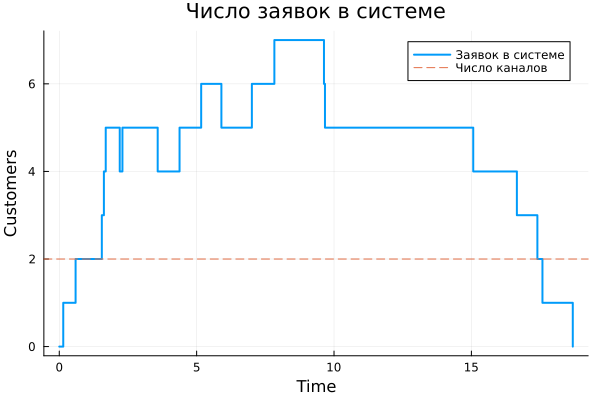
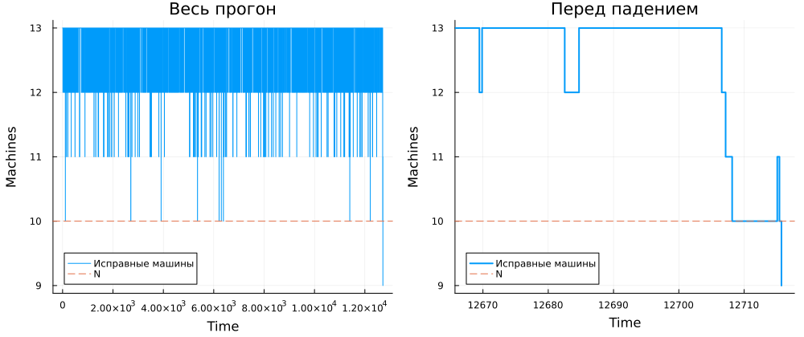
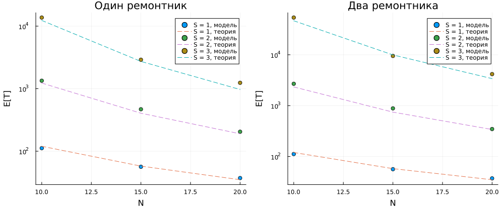

---
## Author
author:
  name: Иван Александрович Бережной
  email: 1132236041@rudn.ru
  affiliation:
    - name: Российский университет дружбы народов
      country: Российская Федерация
      postal-code: 117198
      city: Москва
      address: ул. Миклухо-Маклая, д. 6
## Title
title: "Презентация по лабораторной работе №7"
subtitle: "Имитационное моделирование"
license: CC BY
date: today
date-format: "YYYY-MM-DD" # Example: 2025-09-06
---

# Информация

## Докладчик

  * Иван Александрович Бережной
  * студент
  * Российский университет дружбы народов им. П. Лумумбы
  * 1132236041@rudn.ru

::: notes
- Представиться.
:::

# Вводная часть

## Актуальность

Очереди возникают везде, где заявок больше, чем тех, кто их обслуживает: в банках, на серверах, в ремонтных цехах. Дискретно-событийное моделирование позволяет заранее оценить, сколько придётся ждать и сколько нужно каналов или резерва, даже там, где готовых формул нет.

## Объект и предмет исследования

- Объект: системы массового обслуживания: очередь M/M/c и модель Росса.
- Предмет: время ожидания в очереди M/M/c и время до падения системы в модели Росса при разных параметрах.

## Цели и задачи

- Цель:
    - Освоить дискретно-событийное моделирование и сравнить результаты моделирования с аналитическим решением.
- Задачи:
    - Смоделировать систему M/M/c и построить для неё графики.
    - Смоделировать модель Росса с несколькими ремонтниками и разным числом машин.
    - Оценить загрузку ремонтника и длину очереди на ремонт.
    - Получить из литературного кода чистый код, ноутбуки и Quarto.

## Материалы и методы

Работа выполнялась на виртуальной машине, созданной с помощью VirtualBox на ОС Fedora.

Программное обеспечение:

- Julia с DrWatson, ConcurrentSim, ResumableFunctions, Distributions, StableRNGs.
- Quarto, TeX Live.

# Выполнение работы

## Модель M/M/c

- Заявки приходят случайно с интенсивностью $\lambda$ и обслуживаются одним из $c$ каналов с интенсивностью $\mu$.
- Если все каналы заняты, заявка ждёт в общей очереди.
- Загрузка канала равна $\rho = \lambda / (c\mu)$, и очередь остаётся конечной только при $\rho < 1$.

## Модель Росса

- Постоянно работают $N$ машин, и ещё $S$ машин стоят в резерве.
- Сломанную машину сразу заменяют резервной и отправляют в ремонт, после которого она возвращается в резерв.
- Если машина сломалась, а резерва нет, система падает.

## Как устроено моделирование

- Каждая заявка и каждая машина описаны как отдельный процесс, который ждёт события, занимает ресурс и освобождает его.
- Каналы обслуживания и ремонтники заданы как ресурсы с ограниченным числом мест.
- Модели записывают журнал событий, по которому строятся графики и считается загрузка.

## Скрипты

- Модули `MMcModel.jl` и `RossModel.jl` содержат код моделей и аналитические формулы.
- Два базовых скрипта выполняют код из методических указаний.
- Два скрипта считают набор параметров: 9 вариантов для M/M/c и 18 вариантов для модели Росса.

# Результаты

## M/M/c: базовый прогон

:::::::::::::: {.columns align=center}
::: {.column width="40%"}

Первые две заявки обслуживаются сразу, потому что оба канала свободны, а всем следующим приходится ждать, и чем позже пришла заявка, тем дольше она ждёт.

:::
::: {.column width="60%"}

{width=100%}

:::
::::::::::::::

## M/M/c: число заявок в системе

:::::::::::::: {.columns align=center}
::: {.column width="40%"}

Число заявок быстро поднимается выше числа каналов и доходит до семи, то есть в очереди одновременно стоит до пяти заявок.

:::
::: {.column width="60%"}

{width=100%}

:::
::::::::::::::

## M/M/c: сравнение с теорией

{height=55%}

Модель близка к теории, а заметное расхождение есть только при загрузке 0.9. Третий канал сокращает ожидание с 8.5 до 0.6.

## Модель Росса: базовый прогон

{height=55%}

Почти всё время исправны 12 или 13 машин. Среднее время до падения по пяти прогонам составило 16664 часа при теоретическом значении 12340, а ремонтник загружен примерно на 10 %.

## Модель Росса: набор параметров

{height=55%}

Каждая дополнительная резервная машина увеличивает время до падения примерно в десять раз, а второй ремонтник помогает только тогда, когда резервных машин хотя бы две.

# Заключение

## Главный вывод

- Обе модели реализованы методом дискретно-событийного моделирования, и их результаты согласуются с аналитическими формулами.
- В очереди M/M/c время ожидания резко растёт, когда загрузка приближается к единице.
- В модели Росса время до падения сильнее всего зависит от размера резерва.
- Из литературного кода получены чистый код, ноутбуки и документация Quarto.

::: notes
- Поблагодарить устно и перейти к вопросам.
:::
