---
## Author
author:
  name: Иван Александрович Бережной
  email: 1132236041@rudn.ru
  affiliation:
    - name: Российский университет дружбы народов
      country: Российская Федерация
      postal-code: 117198
      city: Москва
      address: ул. Миклухо-Маклая, д. 6
## Title
title: "Отчёт по лабораторной работе №7"
subtitle: "Имитационное моделирование"
license: "CC BY"
abstract: |
  В работе методом дискретно-событийного моделирования исследованы две системы массового обслуживания: очередь с несколькими каналами M/M/c и модель Росса с резервом и ремонтом. Результаты сравниваются с аналитическими формулами.

keywords: [лабораторная работа, Julia, дискретно-событийное моделирование, M/M/c, модель Росса, ConcurrentSim]
---

# Введение

## Цель работы

Освоить дискретно-событийное моделирование на примере системы M/M/c и модели Росса и сравнить результаты моделирования с аналитическим решением.

## Задачи

- Создать рабочий каталог для кода.
- Установить необходимые пакеты.
- Выполнить предложенный код.
- Преобразовать код в литературный стиль.
- Сгенерировать из литературного кода:
    - чистый код;
    - jupyter notebook;
    - документацию в формате Quarto.
- Выполнить код из jupyter notebook.
- Интегрировать документацию в формате Quarto в отчёт.
- Добавить в код в литературном стиле вычисление для набора параметров.
- Сгенерировать из литературного кода с параметрами:
    - чистый код;
    - jupyter notebook;
    - документацию в формате Quarto.
- Выполнить код из jupyter notebook с параметрами.
- Интегрировать документацию с параметрами в формате Quarto в отчёт.

## Объект и предмет исследования

Объект исследования --- системы массового обслуживания: очередь M/M/c и модель Росса.

Предмет исследования --- время ожидания в очереди M/M/c и время до падения системы в модели Росса при разных параметрах.

## Методы исследования

- Дискретно-событийное моделирование.
- Аналитические формулы теории массового обслуживания.
- Расчёт для набора параметров.

## Схема выполнения работы

На рис. -@fig-flowchart представлена общая последовательность действий при выполнении работы.

::: {#fig-flowchart}

```{mermaid}
%%| fig-width: 100%
graph TD
    A@{ shape: circle, label: "Начало" } --> B[Создать проект и установить пакеты]
    B --> C[Смоделировать систему M/M/c]
    C --> D[Сравнить M/M/c с теорией для набора параметров]
    D --> E[Смоделировать модель Росса]
    E --> F[Сравнить модель Росса с теорией для набора параметров]
    F --> G[Сгенерировать чистый код, ноутбуки и Quarto]
    G --> H@{ shape: dbl-circ, label: "Конец" }
```

Блок-схема выполнения лабораторной работы

:::

# Теоретическая часть

## Модель M/M/c

В системе M/M/c заявки приходят случайно с интенсивностью $\lambda$ и обслуживаются одним из $c$ одинаковых каналов, каждый из которых работает с интенсивностью $\mu$.
Если все каналы заняты, заявка ждёт в общей очереди.
Загрузка одного канала равна $\rho = \lambda / (c \mu)$, и очередь не растёт бесконечно только при $\rho < 1$.

Вероятность того, что все каналы свободны, равна

$$
P_0 = \left[ \sum_{n=0}^{c-1} \frac{(c\rho)^n}{n!} + \frac{(c\rho)^c}{c!\,(1-\rho)} \right]^{-1},
$$ {#eq-p0}

а вероятность того, что пришедшей заявке придётся ждать, находится по формуле Эрланга:

$$
P_{wait} = \frac{(c\rho)^c}{c!\,(1-\rho)} P_0.
$$ {#eq-pwait}

Среднее время ожидания в очереди выражается через эту вероятность:

$$
W_q = \frac{\rho}{\lambda (1-\rho)} P_{wait}.
$$ {#eq-wq}

## Модель Росса

В модели Росса постоянно работают $N$ машин, и ещё $S$ машин стоят в резерве.
Когда машина ломается, её сразу заменяют резервной, а сломанную отправляют в ремонт, после которого она возвращается в резерв.
Если машина сломалась, а резерва нет, система падает.

Состояние системы удобно описывать числом сломанных машин $b$.
Отказы происходят с интенсивностью $N \lambda$, а ремонт идёт с интенсивностью $\mu_b = \min(b, R)\,\mu$, где $R$ --- число ремонтников.
Среднее время до падения $T_b$ из состояния $b$ находится из системы линейных уравнений

$$
(N\lambda + \mu_b)\, T_b = 1 + N\lambda\, T_{b+1} + \mu_b\, T_{b-1}, \quad b = 0, \dots, S,
$$ {#eq-ross}

в которой $T_{S+1} = 0$, а искомое время равно $T_0$.

# Материалы и методы

Работа выполнялась на виртуальной машине, созданной с помощью VirtualBox, на ОС Fedora.

Программное обеспечение:

- git, git-flow.
- Julia с DrWatson, ConcurrentSim, ResumableFunctions, Distributions, StableRNGs.
- Quarto, TeX Live.

# Выполнение лабораторной работы

Работа выполнялась по методическим указаниям [@simmod_lab07].

## Создание проекта

В каталоге лабораторной работы создадим проект DrWatson (рис. -@fig-001).

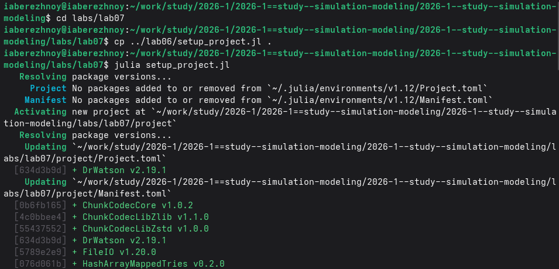{#fig-001 width=100%}

Скриптом `add_packages.jl` добавим базовые пакеты (рис. -@fig-002).

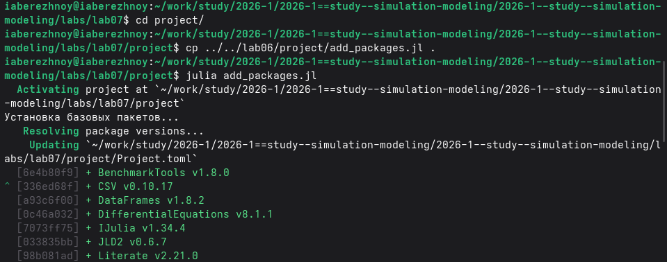{#fig-002 width=100%}

Дополнительно установим пакеты для дискретно-событийного моделирования (рис. -@fig-003).

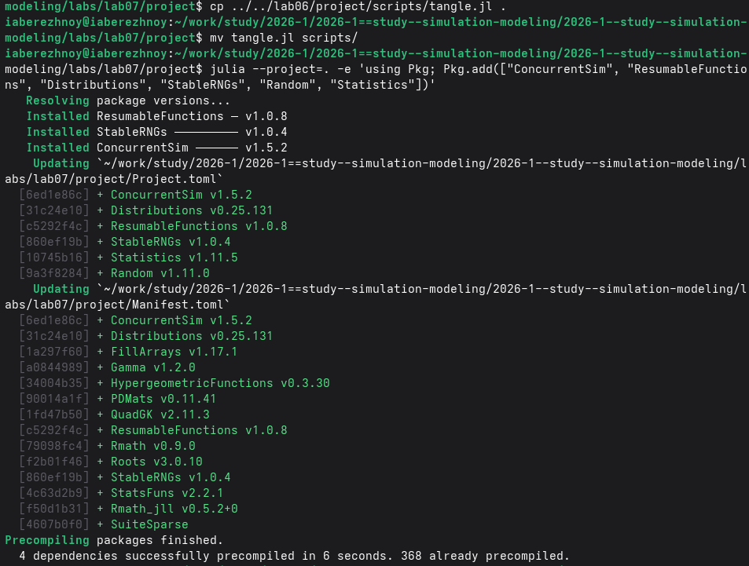{#fig-003 width=100%}

## Модель M/M/c

Код модели находится в модуле `src/MMcModel.jl`. Базовый скрипт моделирует десять заявок при двух каналах, $\lambda = 0.9$ и $\mu = 0.5$ и печатает журнал событий (рис. -@fig-004).

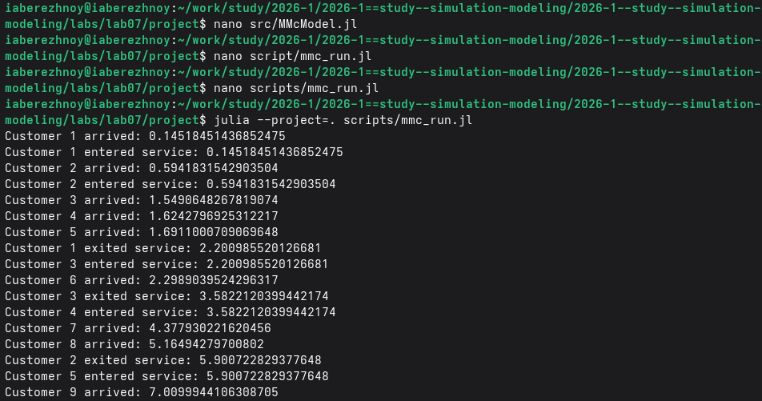{#fig-004 width=100%}

Второй скрипт моделирует 20000 заявок для девяти сочетаний числа каналов и интенсивности прихода и сравнивает результат с формулами (рис. -@fig-005).

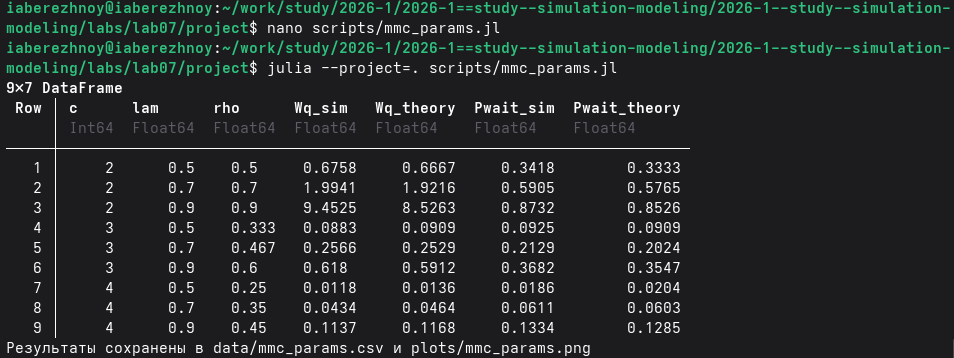{#fig-005 width=100%}

## Модель Росса

Код модели лежит в модуле `src/RossModel.jl`. Базовый скрипт выполняет пять прогонов при $N = 10$, $S = 3$ и одном ремонтнике, а также считает загрузку ремонтника и длину очереди на ремонт (рис. -@fig-006).

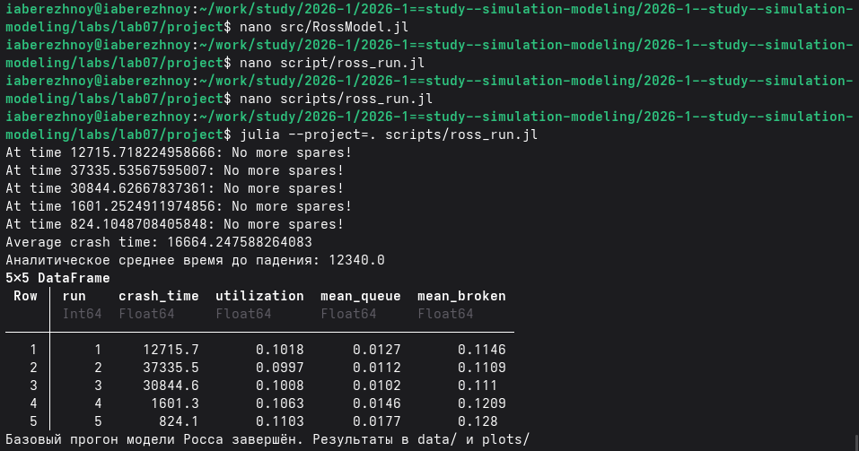{#fig-006 width=100%}

Четвёртый скрипт выполняет по 50 прогонов для разного числа машин, разного резерва и одного или двух ремонтников (рис. -@fig-007).

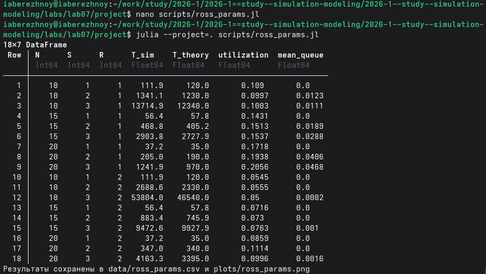{#fig-007 width=100%}

## Генерация кода, ноутбуков и документации

Из каждого скрипта получим чистый код, ноутбук и документ Quarto (рис. -@fig-008).

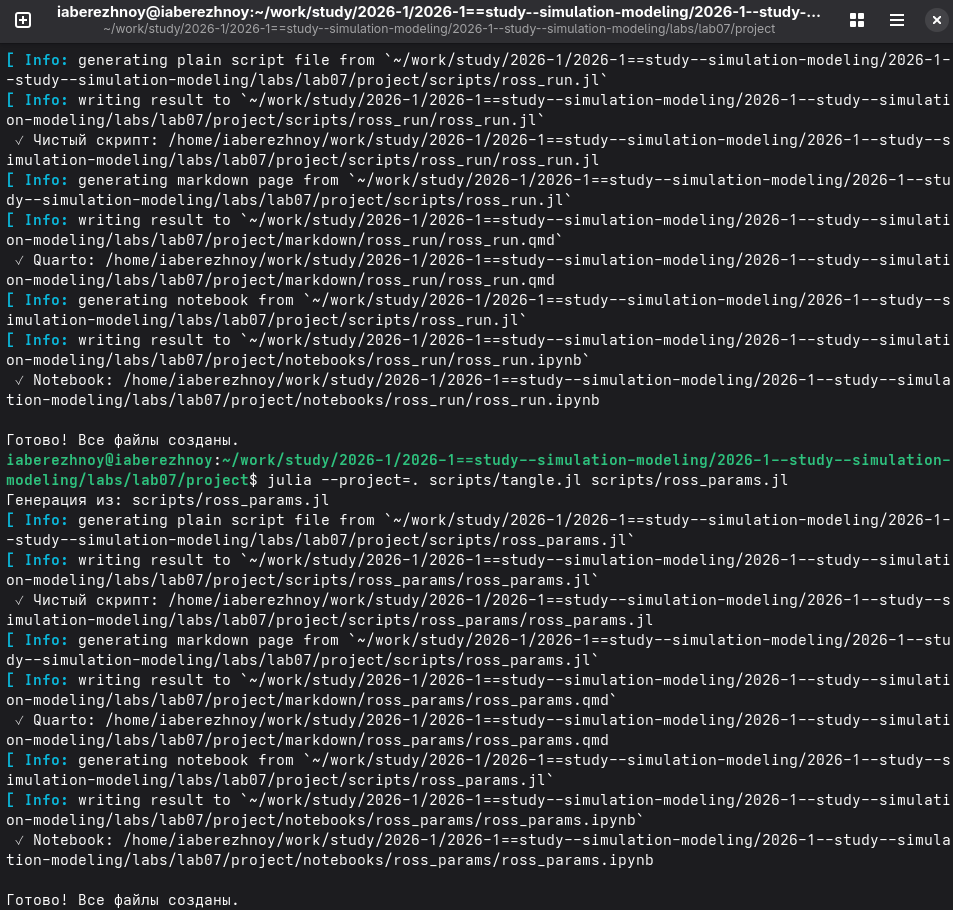{#fig-008 width=100%}

Выполним ноутбуки Jupyter (рис. -@fig-009).

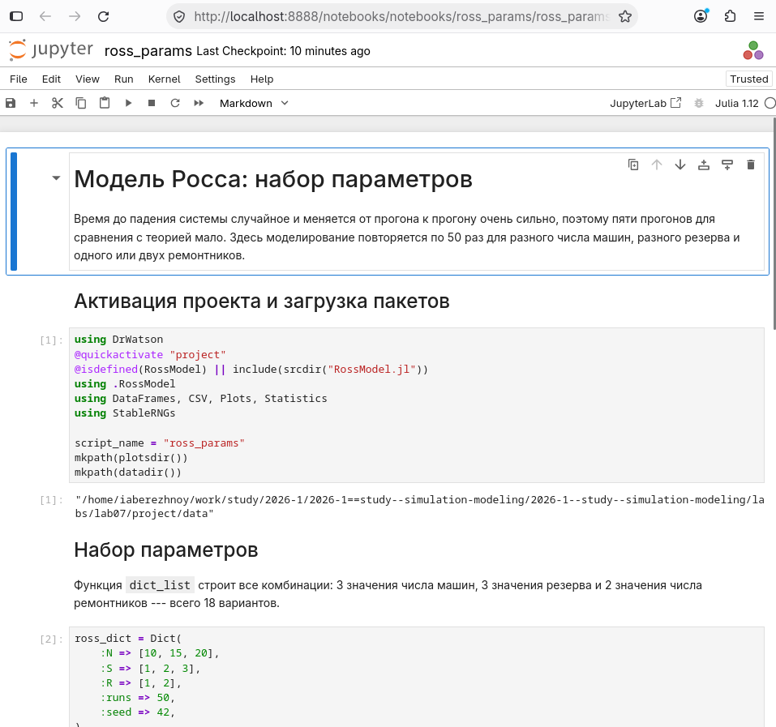{#fig-009 width=100%}

Документы Quarto подключены в приложении.

# Результаты

## Модель M/M/c

В базовом прогоне первые две заявки обслуживаются сразу, потому что оба канала свободны, а всем следующим приходится ждать, причём чем позже пришла заявка, тем дольше она ждёт (рис. -@fig-011).

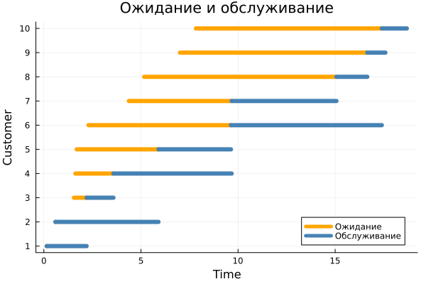{#fig-011 width=80%}

Число заявок в системе быстро поднимается выше числа каналов и доходит до семи, то есть в очереди одновременно стоит до пяти заявок (рис. -@fig-012).

{#fig-012 width=80%}

Результаты для набора параметров приведены в табл. -@tbl-mmc и на рис. -@fig-013.

|$c$|$\lambda$|$\rho$|$W_q$, модель|$W_q$, теория|$P_{wait}$, модель|$P_{wait}$, теория|
|---|---|---|---|---|---|---|
|2|0.5|0.5|0.6758|0.6667|0.3418|0.3333|
|2|0.7|0.7|1.9941|1.9216|0.5905|0.5765|
|2|0.9|0.9|9.4525|8.5263|0.8732|0.8526|
|3|0.5|0.333|0.0883|0.0909|0.0925|0.0909|
|3|0.7|0.467|0.2566|0.2529|0.2129|0.2024|
|3|0.9|0.6|0.618|0.5912|0.3682|0.3547|
|4|0.5|0.25|0.0118|0.0136|0.0186|0.0204|
|4|0.7|0.35|0.0434|0.0464|0.0611|0.0603|
|4|0.9|0.45|0.1137|0.1168|0.1334|0.1285|

: Сравнение модели M/M/c с теорией {#tbl-mmc}

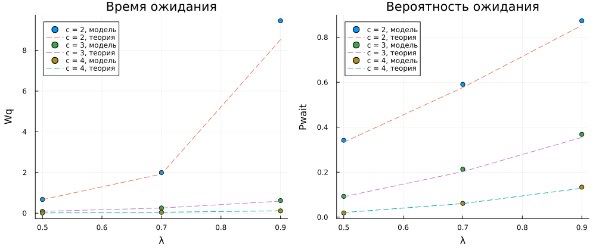{#fig-013 width=100%}

## Модель Росса

В пяти базовых прогонах система падала в моменты 12715.7, 37335.5, 30844.6, 1601.3 и 824.1 часа, так что среднее составило 16664.2 часа при аналитическом значении 12340.0.
Ремонтник был загружен примерно на 10 %, а средняя длина очереди на ремонт не превышала 0.02 (табл. -@tbl-monitor).

|Прогон|Время падения|Загрузка ремонтника|Средняя очередь|Сломано в среднем|
|---|---|---|---|---|
|1|12715.7|0.1018|0.0127|0.1146|
|2|37335.5|0.0997|0.0112|0.1109|
|3|30844.6|0.1008|0.0102|0.111|
|4|1601.3|0.1063|0.0146|0.1209|
|5|824.1|0.1103|0.0177|0.128|

: Мониторинг ремонтника в базовых прогонах {#tbl-monitor}

На графике первого прогона видно, что почти всё время исправны 12 или 13 машин, а до уровня $N = 10$ система опускается редко (рис. -@fig-014).
Перед падением подряд сломались три машины, одна из них успела вернуться из ремонта, но следующие два отказа произошли раньше, чем ремонтник закончил работу.

{#fig-014 width=100%}

Результаты для набора параметров приведены в табл. -@tbl-ross и на рис. -@fig-015.

|$N$|$S$|$R=1$, модель|$R=1$, теория|$R=2$, модель|$R=2$, теория|
|---|---|---|---|---|---|
|10|1|111.9|120.0|111.9|120.0|
|10|2|1341.1|1230.0|2688.6|2330.0|
|10|3|13714.9|12340.0|53804.0|46540.0|
|15|1|56.4|57.8|56.4|57.8|
|15|2|468.8|405.2|883.4|745.9|
|15|3|2903.8|2727.9|9472.6|9927.9|
|20|1|37.2|35.0|37.2|35.0|
|20|2|205.0|190.0|347.0|340.0|
|20|3|1241.9|970.0|4163.3|3395.0|

: Среднее время до падения системы в модели Росса {#tbl-ross}

{#fig-015 width=100%}

# Обсуждение результатов

Модель M/M/c хорошо согласуется с теорией: при загрузке до 0.7 расхождение по времени ожидания не превышает нескольких процентов.
Хуже всего совпадает вариант с $\rho = 0.9$, где модель дала 9.45 вместо 8.53, и это объясняется тем, что при высокой загрузке очередь сильно колеблется и 20000 заявок для точной оценки уже мало.
Главный практический вывод состоит в том, что добавление одного канала сокращает ожидание во много раз: при $\lambda = 0.9$ третий канал уменьшает его с 8.5 до 0.6.

В модели Росса время до падения меняется от прогона к прогону в десятки раз, поэтому среднее по пяти прогонам отличается от теории на треть, а при пятидесяти прогонах расхождение составляет уже 10--30 %.
Каждая дополнительная резервная машина увеличивает время до падения примерно в десять раз, тогда как увеличение числа работающих машин его сокращает, потому что отказы случаются чаще.

Второй ремонтник при одной резервной машине ничего не меняет, поскольку система падает раньше, чем в ремонте окажутся две машины одновременно.
При двух и трёх резервных машинах он увеличивает время до падения в два--четыре раза, хотя сам при этом загружен всего на 5--10 %.

Описание в методических указаниях, по которому резерв при $N = 10$ и $S = 3$ исчерпывается быстро, расчётом не подтверждается: и модель, и формула дают больше десяти тысяч часов.

# Заключение

Цель достигнута: система M/M/c и модель Росса реализованы методом дискретно-событийного моделирования, и результаты обеих моделей согласуются с аналитическими формулами. В очереди  M/M/c время ожидания резко растёт при приближении загрузки к единице, а в модели Росса время до падения сильнее всего зависит от размера резерва.  
Из литературного кода получены чистый код, ноутбуки и документация Quarto.

# Список литературы {.unnumbered}

::: {#refs}
:::

\appendix








