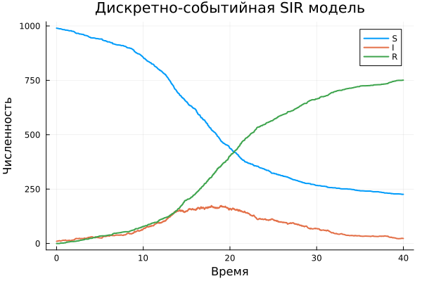
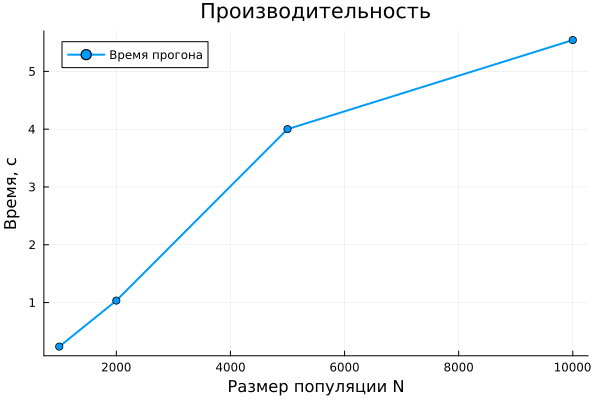
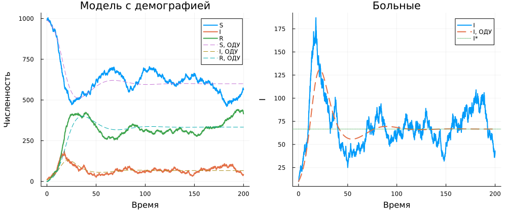
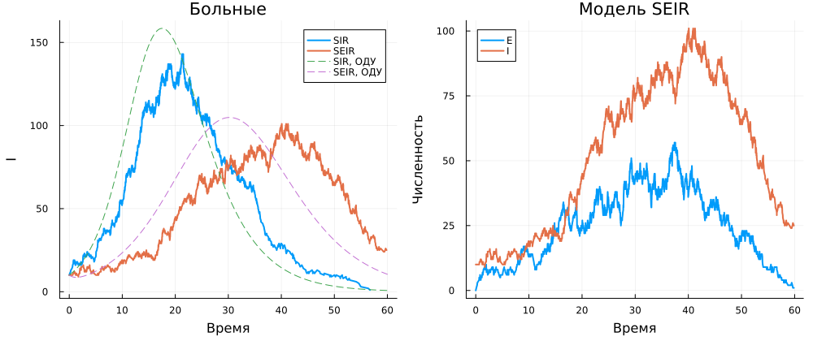

---
## Author
author:
  name: Иван Александрович Бережной
  email: 1132236041@rudn.ru
  affiliation:
    - name: Российский университет дружбы народов
      country: Российская Федерация
      postal-code: 117198
      city: Москва
      address: ул. Миклухо-Маклая, д. 6
## Title
title: "Презентация по лабораторной работе №8"
subtitle: "Имитационное моделирование"
license: CC BY
date: today
date-format: "YYYY-MM-DD" # Example: 2025-09-06
---

# Информация

## Докладчик

  * Иван Александрович Бережной
  * студент
  * Российский университет дружбы народов им. П. Лумумбы
  * 1132236041@rudn.ru

::: notes
- Представиться.
:::

# Вводная часть

## Актуальность

Модель эпидемии помогает понять, как быстро распространяется зараза и какие меры её остановят. В дискретно-событийной модели каждый человек моделируется отдельно, поэтому в неё легко добавить вакцинацию, рождение и смерть или новые стадии болезни.

## Объект и предмет исследования

- Объект: модель эпидемии SIR.
- Предмет: динамика эпидемии в дискретно-событийной модели при разных параметрах и модификациях.

## Цели и задачи

- Цель:
    - Изучить дискретно-событийный подход на примере модели SIR.
- Задачи:
    - Сравнить модель с детерминированной версией и проанализировать параметры.
    - Оценить производительность.
    - Добавить демографию, вакцинацию и латентный период.
    - Получить из литературного кода чистый код, ноутбуки и Quarto.

## Материалы и методы

Работа выполнялась на виртуальной машине, созданной с помощью VirtualBox на ОС Fedora.

Программное обеспечение:

- Julia с DrWatson, ConcurrentSim, ResumableFunctions, Distributions.
- Quarto, TeX Live.

# Выполнение работы

## Модель

- Каждый человек является отдельным процессом и находится в состоянии $S$, $I$ или $R$.
- Здоровый человек в среднем $c$ раз в единицу времени встречает случайного собеседника и, если тот болен, заражается с вероятностью $\beta$.
- Больной выздоравливает в среднем через $1/\gamma$.
- Эпидемия развивается при $R_0 = \beta c / \gamma > 1$, а в базовом варианте $R_0 = 2$.

## Скрипты

- Базовый прогон из методических указаний и сравнение с детерминированной моделью.
- Расчёт для набора параметров: 18 сочетаний $\beta$, $c$ и $\gamma$.
- Замер производительности для 10000 человек.
- Дополнительные задания: демография, вакцинация и модель SEIR.

# Результаты

## Базовый прогон

:::::::::::::: {.columns align=center}
::: {.column width="40%"}

Пик пришёлся на момент 17.9, когда болели 174 человека, а к концу переболел 751 человек.

:::
::: {.column width="60%"}

{width=100%}

:::
::::::::::::::

## Сравнение моделей

{height=55%}

Детерминированная модель даёт почти тот же пик, а при фиксированной длительности болезни эпидемия идёт заметно острее.

## Набор параметров

{height=55%}

Всё определяется числом $R_0$: при $R_0 \le 1$ эпидемии нет, а с его ростом пик растёт.

## Производительность

:::::::::::::: {.columns align=center}
::: {.column width="40%"}

Прогон для 10000 человек занимает около 4.5 секунд, и время растёт чуть быстрее размера популяции.

:::
::: {.column width="60%"}

{width=100%}

:::
::::::::::::::

## Демография

{height=55%}

С рождением и смертью инфекция не исчезает и колеблется около равновесия: примерно 600 здоровых, 67 больных и 333 переболевших. 

## Вакцинация

{height=55%}

Без вакцинации заражается около 770 человек, но если привить половину здоровых, то только около 160.

## Модель SEIR

{height=55%}

С латентным периодом пик ниже и наступает позже, а переболевает почти столько же людей.

# Заключение

## Главный вывод

- Дискретно-событийная модель SIR в целом совпадает с детерминированной, а отличия вызваны скорее случайностью.
- Динамику эпидемии определяет число $R_0$ и для её предотвращения при $R_0 = 2$ достаточно привить половину здоровых.
- Из литературного кода получены чистый код, ноутбуки и документация Quarto.

::: notes
- Поблагодарить устно и перейти к вопросам.
:::
