---
## Author
author:
  name: Иван Александрович Бережной
  email: 1132236041@rudn.ru
  affiliation:
    - name: Российский университет дружбы народов
      country: Российская Федерация
      postal-code: 117198
      city: Москва
      address: ул. Миклухо-Маклая, д. 6
## Title
title: "Отчёт по лабораторной работе №8"
subtitle: "Имитационное моделирование"
license: "CC BY"
abstract: |
  В работе модель эпидемии SIR реализована в дискретно-событийном подходе, сравнена с детерминированной моделью и дополнена демографией, вакцинацией и латентным периодом.

keywords: [лабораторная работа, Julia, дискретно-событийное моделирование, модель SIR, ConcurrentSim]
---

# Введение

## Цель работы

Изучить дискретно-событийный подход на примере модели SIR, проанализировать влияние параметров, сравнить модель с детерминированной версией, оценить производительность и модифицировать модель.

## Задачи

- Создать рабочий каталог для кода.
- Установить необходимые пакеты.
- Выполнить предложенный код.
- Преобразовать код в литературный стиль.
- Сгенерировать из литературного кода:
    - чистый код;
    - jupyter notebook;
    - документацию в формате Quarto.
- Выполнить код из jupyter notebook.
- Интегрировать документацию в формате Quarto в отчёт.
- Добавить в код в литературном стиле вычисление для набора параметров.
- Сгенерировать из литературного кода с параметрами:
    - чистый код;
    - jupyter notebook;
    - документацию в формате Quarto.
- Выполнить код из jupyter notebook с параметрами.
- Интегрировать документацию с параметрами в формате Quarto в отчёт.

## Объект и предмет исследования

Объект исследования --- модель эпидемии SIR.

Предмет исследования --- динамика эпидемии в дискретно-событийной модели при разных параметрах и модификациях.

## Методы исследования

- Дискретно-событийное моделирование.
- Решение дифференциальных уравнений.
- Расчёт для набора параметров.

## Схема выполнения работы

На рис. -@fig-flowchart представлена общая последовательность действий при выполнении работы.

::: {#fig-flowchart}

```{mermaid}
%%| fig-width: 100%
graph TD
    A@{ shape: circle, label: "Начало" } --> B[Создать проект и установить пакеты]
    B --> C[Выполнить базовый прогон]
    C --> D[Сравнить версии и проанализировать параметры]
    D --> E[Оценить производительность]
    E --> F[Добавить демографию, вакцинацию и SEIR]
    F --> G[Сгенерировать чистый код, ноутбуки и Quarto]
    G --> H@{ shape: dbl-circ, label: "Конец" }
```

Блок-схема выполнения лабораторной работы

:::

# Теоретическая часть

В модели каждый человек является отдельным процессом и находится в одном из состояний $S$ (здоров), $I$ (болен) или $R$ (переболел).
Здоровый человек в среднем $c$ раз в единицу времени встречает случайного собеседника и, если тот болен, заражается с вероятностью $\beta$, а больной выздоравливает в среднем через $1/\gamma$.
Время в модели движется скачками от одного события к другому.

В среднем такая модель описывается уравнениями

$$
\frac{dS}{dt} = -\frac{\beta c S I}{N}, \quad
\frac{dI}{dt} = \frac{\beta c S I}{N} - \gamma I, \quad
\frac{dR}{dt} = \gamma I,
$$ {#eq-sir}

а эпидемия развивается, только если $R_0 = \beta c / \gamma > 1$.
При параметрах из методических указаний $R_0 = 2$.

# Материалы и методы

Работа выполнялась на виртуальной машине, созданной с помощью VirtualBox, на ОС Fedora.

Программное обеспечение:

- git, git-flow.
- Julia с DrWatson, ConcurrentSim, ResumableFunctions, Distributions.
- Quarto, TeX Live.

# Выполнение лабораторной работы

Работа выполнялась по методическим указаниям [@simmod_lab08].

## Создание проекта

Создадим проект DrWatson (рис. -@fig-001) и установим базовые пакеты (рис. -@fig-002).

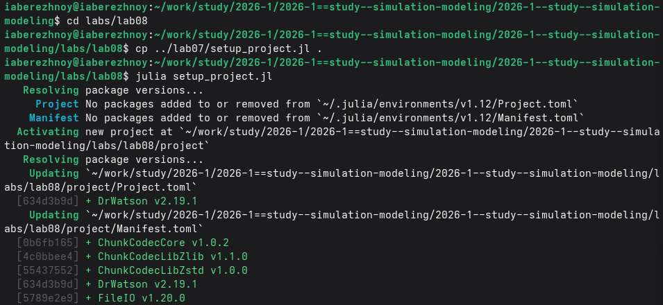{#fig-001 width=100%}

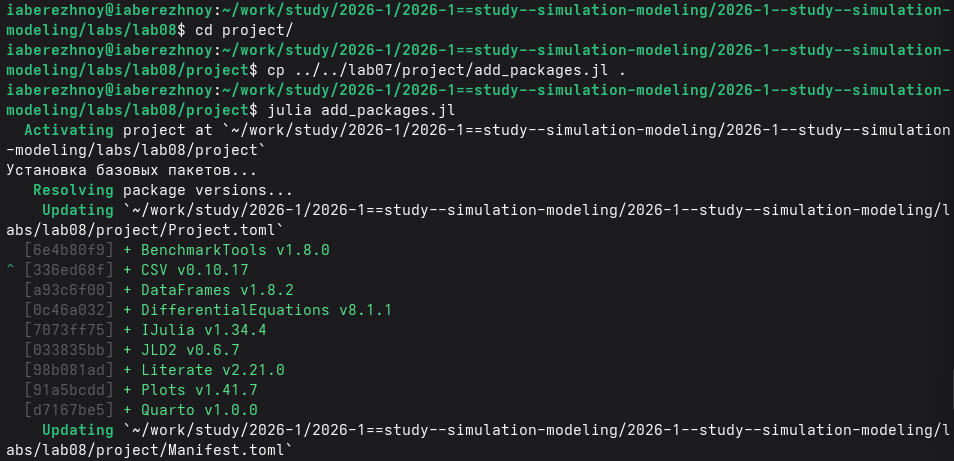{#fig-002 width=100%}

Дополнительно установим пакеты для дискретно-событийного моделирования (рис. -@fig-003).

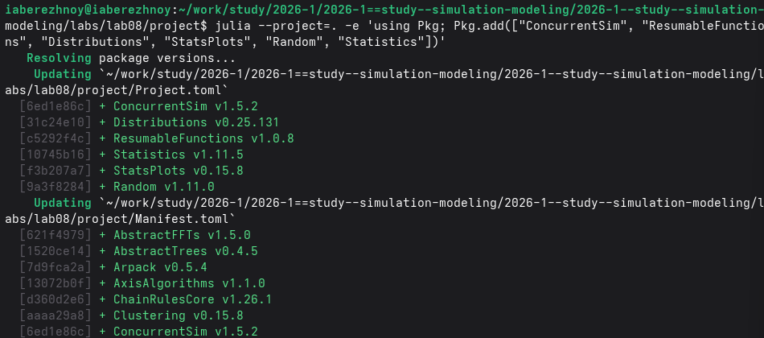{#fig-003 width=100%}

## Запуск скриптов

Код модели находится в модуле `src/sir_model.jl`. Сначала выполним базовый прогон (рис. -@fig-004), затем сравним версии модели (рис. -@fig-005) и проведём расчёт для набора параметров (рис. -@fig-006).

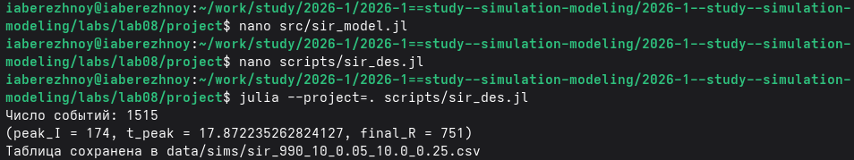{#fig-004 width=100%}

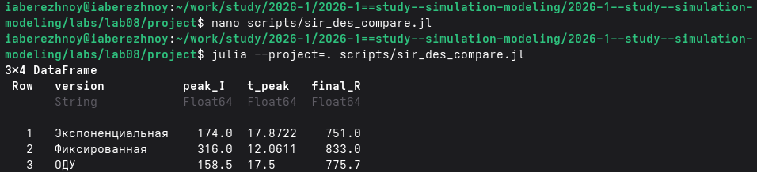{#fig-005 width=100%}

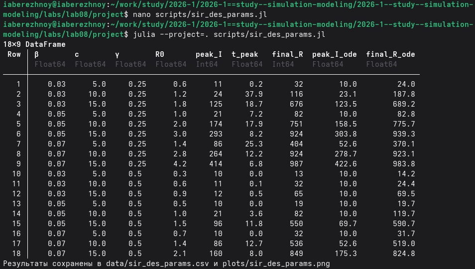{#fig-006 width=100%}

Измерим время прогона для 10000 человек (рис. -@fig-007).

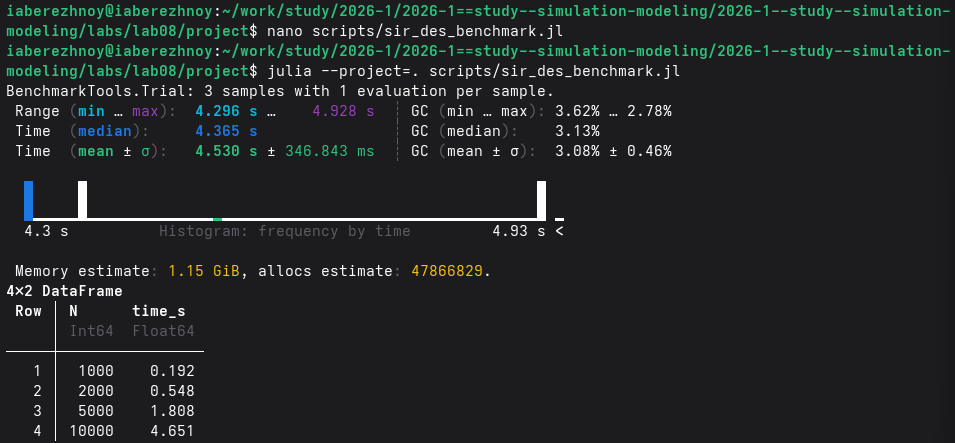{#fig-007 width=100%}

Выполним дополнительные задания: модель с рождением и смертью (рис. -@fig-008), вакцинацию (рис. -@fig-009) и модель SEIR (рис. -@fig-010).

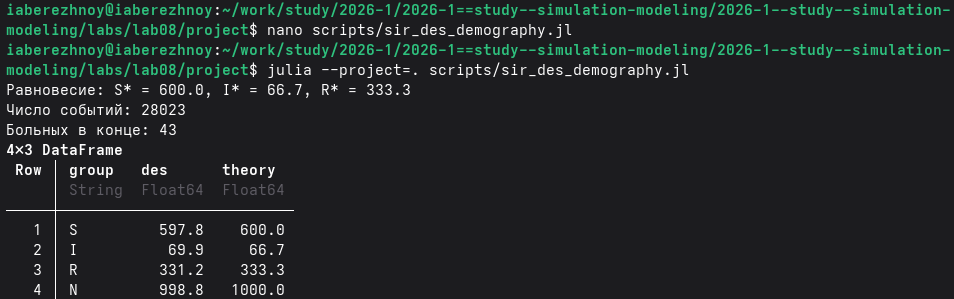{#fig-008 width=100%}

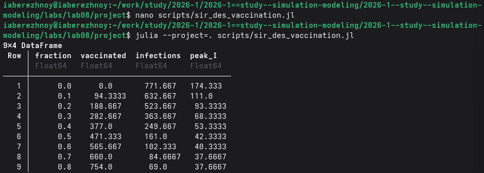{#fig-009 width=100%}

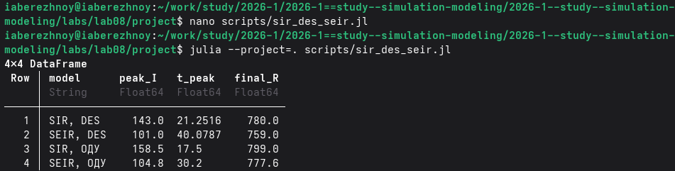{#fig-010 width=100%}

## Генерация кода, ноутбуков и документации

Из каждого скрипта получим чистый код, ноутбук и документ Quarto (рис. -@fig-011) и выполним ноутбуки в Jupyter (рис. -@fig-012).

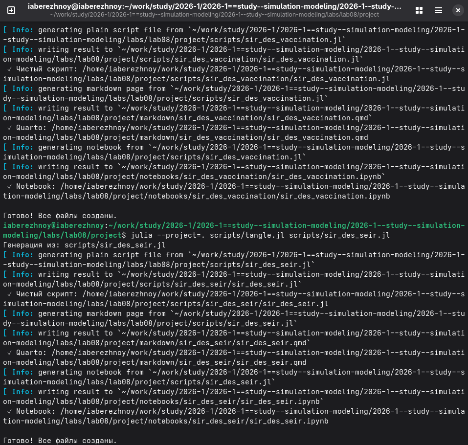{#fig-011 width=100%}

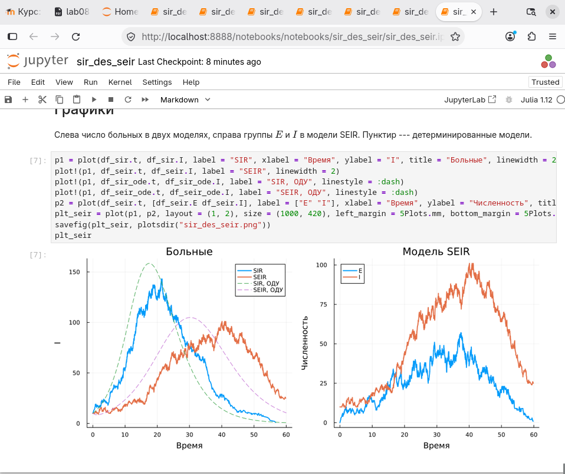{#fig-012 width=100%}

Документы Quarto подключены в приложении.

# Результаты

В базовом прогоне пик пришёлся на момент 17.9, когда болели 174 человека, а к концу переболел 751 человек (рис. -@fig-013).

{#fig-013 width=100%}

Детерминированная модель даёт пик 158.5 в момент 17.5, то есть почти то же самое, а при фиксированной длительности болезни пик вырос до 316 и наступил уже в момент 12.1 (рис. -@fig-014).

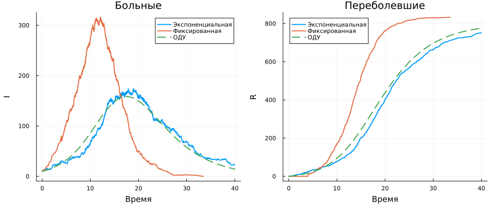{#fig-014 width=100%}

Расчёт для набора параметров показал, что всё определяется числом $R_0$: при $R_0 \le 1$ эпидемия отсутствует, а с его ростом пик растёт (рис. -@fig-015).

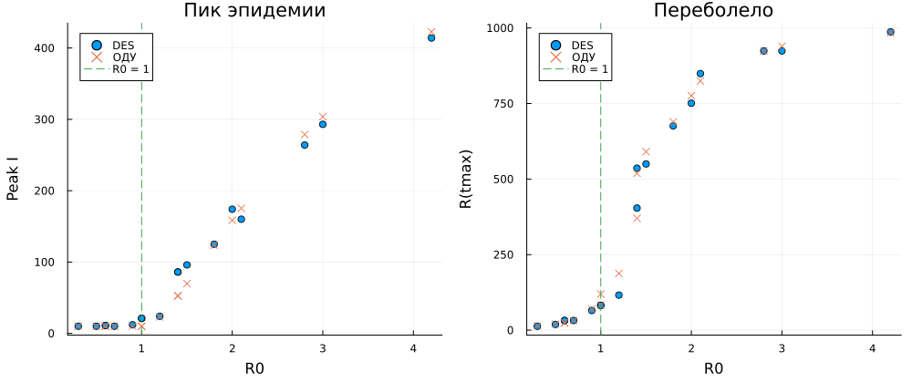{#fig-015 width=100%}

Прогон для 10000 человек занимает около 4.5 секунд, и время растёт чуть быстрее размера популяции (рис. -@fig-016).

{#fig-016 width=100%}

С рождением и смертью инфекция не исчезает, и численность групп колеблется около равновесия: примерно 600 здоровых, 67 больных и 333 переболевших (рис. -@fig-017).

{#fig-017 width=100%}

Без вакцинации заражается около 770 человек, а с ней (привита половина здоровых) только около 160, и дальше число заражений почти не падает (рис. -@fig-018). 

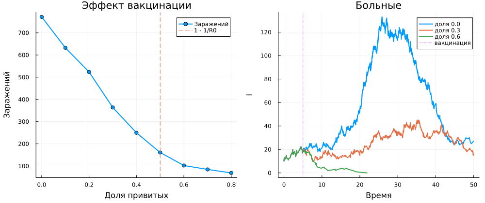{#fig-018 width=100%}

В модели SEIR пик ниже и позже, чем в SIR, а переболевает почти столько же людей (рис. -@fig-019).

{#fig-019 width=100%}

# Обсуждение результатов

Дискретно-событийная модель в целом совпадает с детерминированной, а отличия вызваны скорее случайностью.
При фиксированной длительности болезни эпидемия идёт острее, потому что все выздоравливают одновременно и никто не выбывает раньше времени.
Время расчёта растёт с размером популяции, так как каждая встреча является отдельным событием.
Вакцинация работает так, как предсказывает теория: при $R_0 = 2$ достаточно привить половину здоровых.

# Заключение

Цель достигнута: модель SIR реализована в дискретно-событийном подходе, проанализирована при разных параметрах и дополнена демографией, вакцинацией и латентным периодом.
Из литературного кода получены чистый код, ноутбуки и документация Quarto.

# Список литературы {.unnumbered}

::: {#refs}
:::

\appendix














